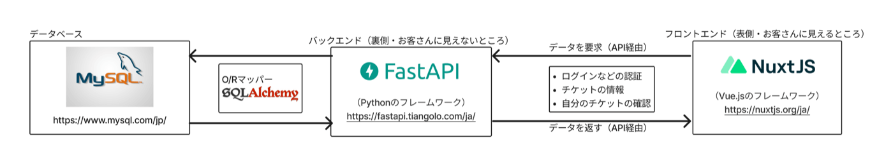

+++
author = "ekkekuru2"
slug="20230415_quaint2022"
title = "【失敗記】日比谷高校星陵祭2022のオンライン整理券システムを制作しました"
date = "2023-04-15"
description = ""
categories = [
    "Tech"
]
tags = [
    "日比谷高校IT委員会",
]
+++

本記事は，日比谷高校文化祭「第 46 回星陵祭」（2022 年 9 月開催）に向けて開発されたオンライン整理券システム"Quaint"の主な機能や開発の経過を紹介するものです．文化祭前々日に発生したシステム障害が原因で，Quaint は実際の文化祭で使用されていません．本記事では”Quaint”開発の経過とともに，システム障害の原因を検証します．書けば書くほど書き足りないし失敗談を公開するのはとても恥ずかしいんですが，このままだといつまで経っても公開できないので，同じようなことを考えてる人の役に少しでも立てればという思いから公開します．

:::message alert
本記事は知見の共有を目的として個人的に執筆されたものです．本記事に関する学校等への問い合わせはご遠慮ください．
:::

# 1.システム概要

GitHub リポジトリはこちらです


## 1-1.目的

### COVID-19 対策

2019 年度以前の文化祭では来場者が体育館に並び，生徒が上演する演劇の入場整理券を取得していました．しかし，密閉空間である体育館に多くの人が密集する状況は COVID-19 対策のために避けたいところです．そこで，一般客の来場も視野に入れた 2022 年度（結局，生徒と保護者のみの入場になりました）は，各自のスマートフォンでオンライン整理券を取得し，各クラスの受付でその整理券を提示することになりました．

## 1-2.主な機能


- 作品紹介
  文化祭で上演される演劇，生徒限定で配信された映像作品が一覧表示されます．タグによる関連付けや，検索機能も実装されていました．
- 映像配信
  COVID-19 禍の 2020,2021 年度から継続して，Microsoft Stream[^1]による映像配信が行われました．Quaint 上からは，Stream にアップロードされた映像にアクセスできます（そのため，映像をアップロードするための大規模なサーバーを用意する必要が無くなります 😋）．
- 整理券の取得
  1 番の目玉機能です．指定された時間になると，見たい演劇の整理券[^2]が取得できるようになります．特に，1 人が同時間帯の公演を複数取得できないようにする点にこだわりました．取得した整理券を各クラスの受付で提示します．[^3]

## 1-3."Quaint"の由来

- "Quaint"は"QUick Authorizing INteglated Technology”の略です．
- 辞書的には"古風で趣きのある"くらいの意味で，新しく導入するシステムにこそ"侘び"が大切であるとの想いを表現しました．というのは表向きの理由で，本当は会議でなかなか決まらず直感的につけました．ネーミングについては再考しても良いかもしれません．

# 2.技術的な構成



## 2-1.フロントエンド

### Nuxt.js

- 割と消去法で選んだかも知れません．全然経験が無かったので，これなら書けそう！と思いました．
- Vue.js がベースなので，迅速にある程度形になったものをつくることができます．
- PWA（Progressive Web Apps）対応も魅力的でした．



### Vuetify(UI ライブラリ)

- 多くの人が一度は触れたことがあるマテリアルデザインで，親しみやすいため選びました．
- Vuetify の場合，既に出来ている部品が多く<v-○○>と書くだけで使えるのがとても便利です．
- また，多くの生徒がスマートフォンからアクセスすることが見込まれたため，レスポンシブデザイン対応も必須でした．
  

## 2-2.バックエンド

### FastAPI（API）

- “Fast”と名前についていて早そうだったから(それくらい焦ってた)選びました．
- また，情報の授業で全員が触れたことのある Python だったので，より多くの人が開発に参加してくれるとの期待もありました（結局バックエンドはひとりで書いてしまいましたが...）．
  

### MySQL（データベース）

- 使用経験が少しあったので選びました．
- そういえばあまり考えずに MySQL を選んだかも知れません．
  

### SQLAlchemy（O/R マッパー）

- API と DB を接続するものです．
- SQLAlchemy の調整不足が，当日発生した障害の主原因と見られます（詳細は後述）．
  

## 2-3.インフラ

詳しくは，予算の部分でも述べますが，Microsoft Azure を使いました．
バックエンド・フロントエンドともに App Service にデプロイしました．データベースは Azure Database for MySQL(柔軟にスケールできるやつ)を使いました．
App Service が良いよっていうのは 3 代上の先輩に教えていただきました．感謝．

# 3.開発・運営の経過

## 2022 年 5 月：導入決定

文化祭実行委員会の中で，オンライン整理券システムの導入が決定しました．文化祭実行委員会 IT 部門がオンライン整理券を管轄します．

### プログラミングをして自前で 1 から作るという選択

この段階では，プログラミングをして 1 から作ることはあくまで可能性の一つでしかなく，既存のサービスを利用することも十分視野に入れて検討していました．しかし，僕たちが調べた限りだと既存のサービスでは

- 星陵祭と関係ない団体の公演も関連ページなどの欄に出てくる．
- 同時間帯に上演される複数公演の整理券を取得できてしまう．- 整理券は当日校内にいる人のみが取ることができるべきだが，インターネット上の誰でも取ることができてしまう
  といった，文化祭ということを踏まえるとあった方がいい要件を満たせないことがわかり,
  プログラミングをして 1 から自分たちで作る構想が始まりました．
  今思うと，この辺を妥協して既存システム使えば楽ではあったのかな

### 予算の確保

全校生徒 1000 人以上が利用する負荷にも耐えられる API サーバー・DB サーバーを用意する必要がありました．インフラには AWS,GCP,Azure あたりのクラウドサービスを候補としていました．予算の検討をした 5・6 月時点で生徒会への予算申請は既に終わっており年度の本予算が組まれていたため，生徒会からの予算は下りませんでした．また，もし仮に来年度以降の予算申請に間に合ったとしても，東京都教育委員会が示す予算規定の中に「実体のないものは購入不可」という規定があるため，クラウドサーバーを契約することはできないということが分かりました．(物理サーバーを買ってきて設置したらいけたのか？)
AWS,GCP,Azure には，学生は数百ドル分のクレジットがもらえるという学割がありますが，学校から支給されるメールアドレスが必要となります．都立高校生が支給されている「@metro.ed.jp」で終わるメールアドレスはメールが受信できないように設定されているため，手続きを進めることができませんでした(後から分かったが，このメアドはそもそも学割の対象校として登録されていなさそう)．AWS には，メアドが登録されていなかったり，対象校でなかったりしても顔つき学生証の画像を送ればいいよという記述もありましたが，AWS に送ってみたところ，確かに Educate プログラムには参加出来ましたがクレジットをもらうことはできませんでした．
そこで今回利用したのが GitHub Education というプログラムです．GitHub の学割のようなもので，これが無料でいいのかってくらい多くのサービスを無料で使えるので学生の方はぜひ調べてみてください．GItHub に顔写真つき学生証を送り，プログラムに含まれていた Microsoft Azure の 200 ドル分のクレジットを使いました．

## 6-8 月：コーディング

オンライン整理券システムについての細かい仕様使用を決定し，実際にコードを書きました．

## 8 月下旬：先生へのお披露目

夏休み終盤にプロトタイプを文化祭実行委員会と担当の先生に見ていただきました．その時の感触が良く，オンライン整理券というもののイメージをお互いに明確化でき，今年度は生徒のみの使用でしたが来年以降の一般の方の来場を見据えるという点でも良かったと思います．

## 9 月初旬：アカウント配布

今回 IDaaS 等は使用しなかったため，生徒が使うアカウントは一括でデータベースに登録し配布するという形を取りました．全校生徒の出席番号を集めて登録し，ログイン情報を印刷したものを学級委員を通して配布するという作業を，IT 部門内の複数人で上手く分担出来たためスムーズに行えました．

## 9 月 15 日（文化祭前々日）：説明会とトラブル，断念

### 午後：Quaint 説明会

この時始めて，全校生徒に対して Quaint の説明が行われました．この説明会中に生徒の皆さんにアクセスしてもらったのですが，説明会の開始早々に Quaint が機能停止し，操作できなくなりました（原因の分析は後述します）．

### 放課後：緊急会議

説明会の後，Quaint を管轄している文化祭実行委員会 IT 部門のメンバーが集まり，システム障害の原因について検討しました．この時点では明確な原因の特定に至らず，Quaint の使用は中止することになりました．本番では Quaint のバックアップとして用意されていた紙の整理券（従来と変わらず）を配布します．COVID-19 対策のため，紙整理券の配布場所を分散させるなどの対策が取られました．

## 9 月 16 日（文化祭前日）

夕方，事前に用意されているはずの紙整理券が裁断されていないことに気づきました．IT 部門以外の文化祭実行委員とともに切りました．紙整理券の管轄は IT 部門ではありませんでしたが，文化祭実行委員会との連携不足の結果だと認識しています．

## サーバダウンの原因

全校生徒への説明会の中で「それでは実際にログインしてみましょう」と言ったときに，1000 人以上が同時にログインして，サーバーが負荷に耐えきれずダウンしてしまいました．

### MySQL の最大接続数

この記事を読んでくださっている大半の方がご存じだと思いますが，MySQL には同時に何セッションまで接続出来るかを設定する max_connections というサーバー変数があります．
どうやら，この MySQL の最大接続数の設定に気づかないという初歩的なミスでサーバーダウンを招いてしまったようです．

```
set global max_connections=5000;
```

データベース側の変数を設定するだけでなく，バックエンドの sqlalchemy の設定でも最大接続数の設定をする必要がありました．

### エラーハンドリング

上記の設定に気づくということに加えて，バックエンド側で，DB との接続に失敗した時の例外をしっかりと処理して，DB と接続出来なくてもサーバーもろとも止まってしまわないようにする必要がありました．

# 5.あとがき

はじめに，生徒のみなさんをはじめ関係者の方には当日のサーバーダウンに伴って大変ご迷惑をおかけしました．そして，一緒に制作に携わった IT 部隊や文化祭実行委員会の方，ありがとうございました．
個人的に，API の設計からフロントエンドの実装，インフラまで携わって制作したサービスを，一瞬だけですが千人規模の方に利用していただけたという貴重な経験ができたことにとても価値を感じています．何よりもすごく楽しかったですし，自分にもこんな Web アプリがつくれるんだという自信になりました．またある程度大規模なサービスでないと遭遇しない問題も経験でき，万全な対応を取ることはできませんでしたが，対処の仕方を知れました．その一方で，技術的な不足はもちろん，様々な人と協力してコミュニケーションをとって進めていくという面での困難や自分の課題を改めて実感させられました．
来年度に向けて，ここまで大きなシステムを組む必要があったのかということは，再検討すべきです．文化祭実行委員会と求める機能についてすり合わせをしてより連携を強化していきたいと思います．

また，以下の記事を特に参考にさせていただきました．ありがとうございました．こちらの方々は本当に尊敬です．もし見てくださっていたら嬉しいなぁ.




この記事は，[@ItsukiKigoshi](https://twitter.com/ItsukiKigoshi) 先輩にインタビューしていただき，内容を記事に起こしていただいたものをベースとして，私が加筆させていただく形で執筆しました．先輩には開発の段階からいろいろな視点でのアドバイスやサポートをいただきました．本当にありがとうございます．

[^1]: 東京都教育委員会で一括契約している Microsoft365 に含まれる映像配信プラットフォーム．配信先が生徒のみに限定できて便利．
[^2]: 日比谷高校の文化祭では全クラスが演劇を上演します．公演ごとに整理券を持っている人のみが観劇できます．
[^3]: 当初は QR コードを使用して受付処理を行うつもりでしたが，技術不足のため目視で確認することになりました．
