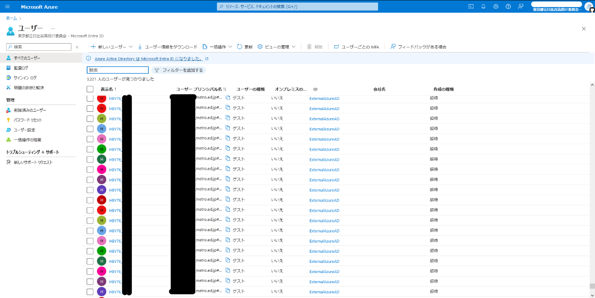

+++
author = "ekkekuru2"
slug="20240718_quaint2023"
title = "【文化祭】日比谷高校星陵祭2023のオンライン整理券システムを制作・運用しました！"
date = "2024-07-18"
description = "2023 年 9 月 16・17 日に行われた東京都立日比谷高等学校の文化祭である星陵祭の Web サイトおよび当日に使用されたオンライン整理券システムを制作しました。"
categories = [
    "Tech"
]
tags = [
    "日比谷高校IT委員会",
]
+++

2023 年 9 月 16・17 日に行われた東京都立日比谷高等学校の文化祭である星陵祭の Web サイトおよび当日に使用されたオンライン整理券システムを制作しました。

実はこのシステムは 2022 年度に一度失敗しており、1 年越しの実現となりました。2022 年度についても記事にまとめていますのでそちらもぜひご覧ください。



もうすぐで 2024 年度の星陵祭が来ちゃうのでいい加減公開しないと

# 主な機能

## 整理券システム

日比谷高校の星陵祭では全学年全クラスが各教室でクラス劇を上演します。

(1 公演 50 分) \* (1 日 5 公演) \* (2 日) = 全 10 公演

普通教室でやる都合上各公演の座席数は限られているので、観劇するための整理券を Web サイト上で配布する仕組みです。

2023 年度は初の実施だったため、2022 年度のようにサーバーが落ちたり不具合が発生したりしたら困るということで様子見として以下のような対応となりました。

- 生徒と教員はオンラインで取得
- 一般客は従来通り紙での配布
- 保護者・家族はオンラインと紙のどちらも使うことが出来る(デジタルに不慣れな保護者・家族への対応策が万全には用意出来なかったため)


_当日配布されたパンフレットに掲載されたオンライン整理券システムの使い方のページ_

## Web サイト




_トップページ_


_団体一覧ページ_

今までは星陵祭企画委員会(以下「チーフ会」)の方々が Wix などの Web サイト制作ツールで作っていた星陵祭公式 Web サイトを seiryofes.com に統合しました。

各クラスの演目の情報などが載っている Web サイトとオンライン整理券システムが別のページにあるのは使いづらいと考えたからです。

各クラスの個別ページが用意されており、生徒がサムネイル画像や演目の説明文を設定したり SNS アカウントへのリンクを追加したりできます。

開催スケジュールや学校へのアクセスといった基本的な情報もわかりやすく掲載しました。

## インフォメーションボード

校内 4 か所にテレビ・プロジェクターを設置し地図や公演時間の情報などを表示しました。


_剣道場(紙整理券の配布場所の 1 つ)に置かれたテレビ_

実は本来は、紙整理券とオンライン整理券どちらを使うこともできるという対応になった保護者のために、紙整理券の配布場所でオンライン整理券の取得状況を表示する案でした。

なにせ結構直前に出た案だったので、とあふ[^1]が[1 日目の朝ギリギリまで健闘](https://github.com/hibiya-itchief/2023-quaint-app/pull/466)してくれて、開発環境では動作したのですが、後述する AsyncData が原因で上手く動作しない問題を本番までに解決出来ませんでした。

# 背景

- COVID-19 の感染抑止
  - オンライン整理券システムの計画が本格的に始まった 2021 年度のきっかけは，COVID-19 対策
  - しかし結局 2023 年度は、細かい制約はあり完全にコロナ禍以前とはいかなかったものの、COVID-19 による大きな制約を受けずに星陵祭を開催することができたため、整理券システムにも COVID-19 を意識した機能はありません。
- クラス劇整理券の効率的な配布
  - 星陵祭ではコロナ禍以前からクラス劇の整理券配布の混雑が悩みの種でした。まだ暑さが残る 9 月の体育館に 5000 人以上にも上る来場者が列をなし、そこで全クラス分の観劇整理券を配布する、というのはなかなか大変だったと聞いています。(写真などを入れる)
  - コロナはあくまできっかけで、長年の課題の解決策という認識
  - チーフ会の当日業務負担軽減
- Web サイトとしての機能および内容充実・広報力の強化
  - 途中からそれも意識し出していたと思う
- 映像配信のプラットフォーム
  - 当日 2 日間の全 12 公演ではすべてのクラスの劇を見ることは出来ず、キャストを担当する生徒の中には全く他クラスの劇を見られない人も出てきます。
  - 当日の公演を各クラスで撮影してアップロードし、後日生徒のみが見られるようにする仕組みです。
  - そもそも映像配信は COVID-19 により星陵祭が全く実施できなかった頃に始まっている。コロナ禍の数年間、Microsoft SharePoint や Stream,Teams などいろいろな形態を辿ってきた。

## 独自でプログラミングをして 1 から作ることにした理由

世の中には既に SaaS として利用できる素晴らしいチケットシステムがたくさんあります。(teket などはオケ部や合唱部がコンサートやるときにも使っていた。)

なぜわざわざ自作という茨の道を往ったのか。その理由は SaaS では実現できない以下の仕様を満たすためです(調査不足で本当は出来る機能があったらすみません)

これは COVID-19 の影響で、企画時点では星陵祭が行われる 9 月にどのような情勢になっているかが全く読めなかったために星陵祭の開催方式が定まらず、様々な可能性を考慮した幅を持たせた設計にしたことにも起因しています。(以下に理由として挙げたが最終的には実装しなかった機能もいくつかある)

- 入場制限の必要性
  - 実際に学校敷地に来場していないと整理券を取れないように
  - インターネット上の任意の人が(観劇する意思がないのに)整理券を取れてしまうと、各クラスで用意している座席数は結構少ないので致命的。整理券は売り切れているけどお客さんがいない、ということになったら悲惨。
- 1 人が同じ時間帯で複数クラスの整理券を重複して取ることを制限出来ない
  - 例) 11R の 1 日目第 1 公演の整理券をすでに取っているのに、同じく 1 日目第 1 公演の 12R の整理券も取る。
  - いわゆる荒らし行為を防ぐ目的
  - 世の中の SaaS では、ある 1 つの団体について同一人物が複数枚チケットを取ることを制限する機能はあるように思いますが、その制限を複数団体にまたがってかけることは出来ないように思われました。
- 関連団体の部分に星陵祭とは全く関係のない団体が出てくることがなんか嫌

  - 下にスクロールしたりすると出てきますよね

- Web ページとの連携
  - 各団体の紹介や SNS リンク、動画配信などとのスムーズな連携を実現
- 日比谷高校の星陵祭のニーズにぴったり合う独自機能
  - 投票機能との連携
    - 整理券を取って実際に観た劇にのみ投票が可能
    - 従来は、取った紙整理券をそのまま投票箱に入れることで、クラス劇への投票を兼ねていた
    - たしかに、実際に観ないと良しあしは判断できないですよね
    - 2023 年度は実装予定でしたが、間に合いませんでした...
  - 入学を検討している中学生が優先的に整理券を取れる仕組みとかも考えた時ありました
- 独自で作ってみたいという個人的な興味
  - これは否定できません
  - 後述する筑駒や麻布の例に刺激を受け自分もやってみたいと思いました。


_生徒会室での会議の様子(2023 年 1 月 16 日)_

今後の後輩が、私たちが作ったシステムをより良く変えながら使っていくことはそりゃあとても嬉しいのはその通りですが、毎年毎年、本当に自作で行くメリットが上回るのかの検討はして欲しいと思います。SaaS で必要な要件が満たせるならそれが良いと思う。

# 制作の時系列

### 2022 年 9 月

詳細は[昨年の記事](https://blog.ekke.jp/articles/20230415_quaint2022)をぜひご覧ください。

チーフ会の要求する仕様と IT 部隊の認識との間にズレがあるなど、チーフ会との連携不足も課題だと感じていたため 2022 年度の星陵祭が終わった直後からチーフ会整理券担当の S[^2]と頻繁にしゃべることを意識していました。
またこの時期から、星陵祭チーフ会の下に所属していた IT 部隊を「IT 委員会」として独立した組織にする計画が進んでいきます。
IT 部隊が IT 委員会になるストーリーは日比谷高校雑誌委員会が発行している「いてふ台」の次の号に載せていただけるらしいのでそちらもぜひ読んでみてください。

### 2022 年後半

そもそも一般のお客さんは来場できるのか、来場できるとして人数制限は必要なのか、等開催方式が揺れていました。
2022 年度にサーバーが落ちてしまったことによる先生方の不安感は当然あったと思うので、オンライン整理券システムを正式に使うのか、従来通り全て紙による配布にするのか、というところからの議論でした。
ある程度 2022 年度のサーバー落ちの原因は分析出来ており今年は成功できるだろうという自信と、オンライン化によるメリットは大きいはずだという判断があったので地道な準備や説得を続けました。チーフ会委員長をはじめチーフ会の何人かが「オンラインにした方がいい」と言ってくれていたのも背中を押しました。

ところで 2022 年度は製作途中の画面を逐一先生方やチーフ会に見せる、ということをしていなかったのも良くなかった。2022 年度の星陵祭直前 or 直後に、実際にスマホを操作してオンラインで整理券を取る流れを生徒会担当の先生に見せたら好感触だったのを覚えている。もっと早くやるべきでした。

2023 年度に向けたコーディングを本格的に始めたのは 2023 年 3 月ごろからのようです

↑ 今見ると見当違いなこともいくつか書いていて恥ずかしい

### 2023 年 4 月 IT 委員会 新入生募集大作戦

IT 委員会は出来たばかりの組織であり、今後どうなっていくかは発足初年度である 2023 年にどれだけ新入生を集められるかにかかっていると考え、気合を入れた新入生募集を行いました。

- 「IT」という文字をとにかく大きくして目に入るように
- 当時の技術部のメンバー 5 人で 1 人 1 問ずつ作った情報やコンピュータに関する問題を載せ興味を引くように
  - 論理回路,二分探索,巡回セールスマン(のようななにか),ナップザック問題,などなど


_パンフレットの全パターンは[こちら](https://github.com/hibiya-itchief/2023-spring-problems/blob/main/problems.pdf)_

ちなみに技術部員が作った解答の HTML もすごく面白いのでぜひ見てみてください

https://hibiya-itchief.github.io/2023-spring-problems/nand-circuit/

↑ 特に好き 編集後記の「なかなか良い NAND(難度)でできたのではないでしょうか。」とか

https://hibiya-itchief.github.io/2023-spring-problems/detect-hensachi/

https://hibiya-itchief.github.io/2023-spring-problems/genkai-student/

https://hibiya-itchief.github.io/2023-spring-problems/syukudai-selection/

https://hibiya-itchief.github.io/2023-spring-problems/mysterious-symbol/

入学式の日(在校生は登校しなくてもいい日)に登校して、新入生の各机に配り生徒会室前や各教室の黒板にも貼らせてもらいました。

入学式の朝って多くの一年生は近くの人に話しかける勇気は出ず、配られてるいてふ台を読むか PTA 会報を読むかしかやることがないと思う(私はそうでした。結構面白くてあっという間に時間すぎるのよね)ので、全 5 種類ある IT 委員会のパンフレットを周りの人と持ち寄って話すきっかけになればいいかなとかも考えてましたねそういえば(実際どうだったのかは知らない)

Twitter や Instagram 等にも掲載し、結構反響があったのが嬉しかったです(SNS では専ら在校生からの反応がメインだった)

発案が結構直前だったため時間が無く QR コードだけ先に載せて紙を印刷してから解答 HTML を作ってアップロードしたりしてた。首の皮一枚すぎる。焦って作ったので実は問題にいくつか不備があります...お恥ずかしい。Twitter で在校生に指摘されたりもしましたね...

ちなみに、スマホの写真フォルダには 2023 年 1 月に ↓ の広告の写真が何種類も残っているので、おそらく当時の僕は ↓ の東急の Urban Hacks の広告にすごくわくわくして影響を受けて自分でも似たようなことをやってみたくなったのだと思います。


### 2023 年 4 月 26 日 負荷テスト

いきなり星陵祭本番を迎えて、そこで初めてやってみて上手くいきませんでした、では困るということで生徒総会の後の時間を頂いて全校生徒に端末を操作してもらう形の負荷テストを行うことになりました。もちろんそれまでの開発段階で JMeter 等の負荷テストツールを使った負荷テストは実施していたのですが、ツールではない実際の負荷ではまた事情が違うかもしれないというのと、2022 年度のサーバー落ちで先生方には当然不安感があったと思うので全校生徒の前でちゃんと動作することを示すいいパフォーマンスの機会だな、とも考えていました。

しかし当日になって急遽ストップがかかります。委員会担当の先生には事前に実施する内容を伝えて連携を取っていたつもりですが、配布したプリントが全ての先生方に十分に周知出来ていなかったようで(？)急遽ストップがかかり僕と委員長が体育館のステージに登壇し突然の中止を発表・謝罪しました。何重にでも先生方と連携を取ることの重要性を痛感した出来事でした


_当時の UI(信号機状態の空席表示や「お気に入り機能(未実装)」など相当荒削り)_

### 2023 年 5 月 15 日「負荷テスト・再」

体育大会直前準備の時間を少しいただきリベンジ。

具体的な負荷テストの内容は、放送で指示をしながら、生徒 1 人の端末から、3 人分,5 人分,最終的には 10 人分のリクエストを同時に飛ばす、というもの。
保護者や一般客が利用して負荷が増えるという想定です。

あれほど気を付けてたのに max_connections が小さい値になっていました。どこかのタイミングで DB サーバーを作り直したときに設定し直すのを忘れていました。500 エラーが出て焦ったが、Azure の MySQL の設定の画面から変更すると、1 分ほどで反映されました。まあすぐ変更出来るってことが分かって良かった！と捉えます。


_5 月負荷テストの API サーバーの負荷の様子_


_5 月負荷テストの DB サーバーの負荷の様子_

12:20 ごろ DB の aborted connections が増加、500 エラーの数が 1400 近くなり、max_connections の値が小さいことに気づく

12:23 ごろから無事 DB のコネクション数が増えて 500 エラーが収まる

最大瞬間風速は 12:25 分ごろ、35,000/分の HTTP リクエストを捌き、DB のクエリは 20 万/分超えている、DB のコネクション数は 3000 を超えている

この時は、MySQL サーバー側の max_connections の値を上げて対応しましたが、本来は(DB から見た)クライアント側の sqlalchemy で同時接続数を制限しておく方が正しそうということも知りました。確かに前者のやり方では結局さらに負荷が増えたら同じことですもんね。

やはり RDB 難しい。お恥ずかしながら僕は 2022 年度にサーバー落ちして初めて max_connections の存在を知りました。FastAPI 公式ドキュメントのデータベースとの接続の項には同時接続数についての注意は書かれていないように思うし、RDB を使ったアプリを作ってみよう、的な Qiita や Zenn の記事とかにも書かれているものって見たことないような気がします...どこでこういう情報を仕入れたらいいんだ...RDB については何となく使うのではなくどういう仕組みなのかちゃんと勉強して理解してから使う必要がありそうです。業務で RDB を使う人にとっては当たり前すぎる内容なんでしょうかね

1 人で 10 人分のリクエストを送るといういちばん高負荷として用意していたものまで問題なく終わり、先生方に負荷テストの結果について説明する資料を作成。負荷テストが上手くいったことが後押ししたのか、これ以降オンライン整理券制度についての検討が加速してより詳細なことが決まっていったような気がします。

生徒のみなさんからしたら明日体育大会なのに何をやらされているんだろうという感じだったでしょう。ご協力ありがとうございました。ちなみにその翌日の体育大会の様子はこちら ↓

2022 年度のサーバー落ちをいじられて 3 年次のクラス T シャツの背ネームは「サーバー復旧中」になりました。星陵祭本番もこの T シャツで臨みます。

日比谷高校 IT 委員会 (@hibiya_IT) Twitter より

> 日比谷高校では合唱祭が終わりましたが、こちらは体育祭の時の写真です。我らが技術主任（CTO）、体育祭中でも頑張って落ちたサーバー（？）を復旧しています！&mdash; [日比谷高校 IT 委員会 (@hibiya_IT) July 3, 2023](https://twitter.com/hibiya_IT/status/1675751255430541312?ref_src=twsrc%5Etfw)

### 9 月 7 日

日比谷高校では夏休み明けに期末考査があるため星陵祭に向けて動けるのは考査が終わってからになります。もどかしい。そして時間が無い。
チーフ会顧問の先生にほぼほぼ完成した状態をお披露目しました。実際に先生のスマホを使って整理券を取る流れを操作していただいたところ、めちゃくちゃ褒めてくださった記憶があります。嬉しい。
前述の通り、初年度の様子見としてオンラインと紙を併用することになっていたため、オンラインで配布する座席数と、一般向けに紙で配布する座席数の配分を検討しました。
オンラインが売れ残り、紙が売り切れになってしまって、一般客が取りたいのに取れなくなっちゃうのでは？はたまたその逆は？など、前例がないゆえに想像するしかない難しさがありました。


_体育棟 1 階で会議。エアコンが無くてとにかく暑かった_

### 9 月 1?日　保護者用アカウントの差し込み印刷

保護者用のアカウントは生徒を通じて配布しました。事前に Azure AD の一括作成機能で作成した 1 人ひとり違う保護者用ユーザーの情報を、使い方などを記載した Word ファイルに差し込み印刷しました。
IT 委員会総務部の人たちが後は印刷するだけの状態にしてくれていたのですが、差し込み印刷に慣れておらずなかなかうまくいかず、差し込み印刷に熟達した化学科の先生に手伝ってもらいながら、チーフ会担当の先生とチーフ会整理券担当の S[^2]と(単純に枚数も多かったので)20:00 くらいまで居残りして作業しました。

### 9 月 13 日 直前負荷テスト

5 月にやった負荷テストを念のため直前にもう一度やる予定になっていました。
5 月の時点でサーバーに問題が無いことは確かめられていたのでどちらかと言えば生徒の皆さんにオンライン整理券システムの使い方を周知する、というのがメインの内容でした。
5 月の負荷テスト時点ではまだ先の話だった星陵祭が数日後に迫り、星陵祭ムードになっていたためか、Web ページや整理券システムについてすごいーという声が聞こえて嬉しかったです。

その後、直前負荷テストが無事終了したことへの感謝と本番の成功を祈り校舎の裏にある日枝神社に参拝しました。

日比谷高校 IT 委員会 (@hibiya_IT) Twitter より

> 昨日の負荷テストでは生徒の皆さま方のご協力、ありがとうございました！<br>私たちはその後、日枝神社に参拝し、オンライン整理券制度の成功を祈りました。<br><br>星陵祭がついに明後日に迫りましたね。[seiryofes.com](2023.seiryofes.com)にはクラス劇および有志団体の一覧が掲載されています。ぜひご覧ください！[&mdash; 日比谷高校 IT 委員会 (@hibiya_IT) September 14, 2023](https://twitter.com/hibiya_IT/status/1702305779213349216)

### 9 月 13 日 心臓に悪すぎる実装ミス

保護者が、スマホを持たない子どもなどと一緒に観劇することを想定して、1 つのアカウントで 3 人まで観劇できるような仕様でした。(ひと家庭に 2 つアカウントを配布したので合計 6 人まで)
上記を実現するために、DB の設計としては Ticket テーブルの person というフィールドで 1 枚の整理券で何人観劇出来るかを持っていました。

整理券が売り切れていないことを判定する条件は
「(その公演に登録されている座席数) > (現時点で整理券を取り観劇することになっている人数)」
となるはずですが、Ticket テーブルの「レコード数」をカウントする実装になっていたのです。
正しくは Ticket テーブルの「全てのレコードの person フィールドを合計」しなければなりません。



↑ めちゃくちゃ焦っている issue



家で API のソースコードを眺めながら最終確認してた時に気づいたのですが、正直なんでこれに気づけたのかわかりません。神様が味方してくれたんだと思っています。これに気づけなかったら、用意されている座席数以上に整理券を配布してしまうことになり、大惨事になってたと思います。

2022 年度はほぼ全てのエンドポイントや関数に対して Pytest でテストコードを書いていました。しかし、後述しますが認証方法を Azure AD に変更したことで 2022 年度のテストコードがそのままでは動かなくなり(今考えれば FastAPI の dependency_overrides を 1 つ追加するだけでよかったのだが)、めんどくさくなり Pytest をやめてしまったのです。テストコードをしっかり書いていれば、条件を勘違いした実装で突き進んでしまうことも防げたのでは無いかと思います(テストケースを書く時も条件を勘違いしてたらダメだが)。身をもってテストコードの大切さを実感しました。

### 9 月 15 日 23:55〜 「ギリギリの公演情報入力」

オンラインと紙の枚数配分が最終決定したのは前日の 23:55。家族用優先券に関しての訂正が前日まで相次いだためです。

※家族用優先券：保護者が自分の子どものクラスの公演は整理券取得競争に参加せずとも必ず観劇できることを確約するもの

Discord でチーフ会整理券担当の S[^2]から Excel ファイルが送られてきました。ほんとお疲れ様。来年はこの保護者アンケートもデジタル化して自動で集計 → オンライン整理券システム反映に出来たらいいな。
そこから IT 委員 7 名にバトンタッチしてシステムに「手作業で」入力。Excel ファイルを手作業で写すだけでも苦行なのに、極めつけは実用を考えていない使いづらい UI に苦しみます(自分で作ったのに)

- 1 公演ずつでしか入力できない
  - (1 日 5 公演) _ (2 日間) _ (24 クラス) = 240 回 の単純作業の繰り返し
- 公演時間を毎回手入力 - 2022 年度は予め用意された時間枠からしか選べない形式だったのを、2023 年度は公演の時間帯を自由に設定できるように変更しました。地味な進化ポイント - クラス劇以外の Hebe(体育館でやるステージ発表のこと)や部活動の発表などでも使うことが出来るように、というつもり - でもその機能追加が仇になった - プルダウンで第何公演かを選ぶようにすれば大分楽だった

  

  

というのも UI を作った当時は、各クラ代が自分のクラスの公演は自分たちで追加をするイメージでした。IT 委員会が、しかも前日に徹夜して全クラス全公演まとめて追加するイメージではなかった...

2024 年度は[csv ファイルをもとに公演を一括作成する機能](https://api.seiryofes.com/docs#/admin/create_all_events_from_csv_support_events_post)が実装されています！後輩ありがとう

### 9 月 16 日 1 日目

当日は保健室前に用意した相談ブースを拠点にして、IT 委員が交代で常駐して、オンライン整理券システム使用者のトラブルに対応しました。

> ついに星陵祭が始まりました！！IT 委員はここで整理券システムの監視等を行なっています！<br>Web サイトやオンライン整理券についてお困りのことがあれば、ぜひ正面入り口右手のこちらにお越しください！ [&mdash; 日比谷高校 IT 委員会 (@hibiya_IT) September 16, 2023](https://twitter.com/hibiya_IT/status/1702852591875657777)

当日になって発覚した主な不具合は以下です。

- 配布時間や座席数の入力ミスが一部あった。
  - 前日に徹夜して焦って入力したことによるヒューマンエラー
  - 34R のサウンドオブミュージックを見ながら、ItsukiKigoshi[^3]と修正をしました。
  - 大半は配布開始までに対応出来たが、21R の公演が重複して登録されたまま配布が始まってしまい、「ごめんなさい整理券多く配りすぎちゃった追加で 8 人入れられますか？」
  - 改めてひどい。何とか対応してくれてとても助かりました
- 売り切れていないのに売り切れと表示される公演がいくつかあった
  - [この PR](https://github.com/hibiya-itchief/2023-quaint-app/pull/457)が原因そう
  - nuxt generate して Static Page としてデプロイする場合の、asyncData()が呼ばれるタイミングについて理解不足でした。
  - ただし、売り切れと表示されていても、売り切れていなければボタンを押せば取得は出来たので整理券の配布は行えた

このように不具合はありましたが、まあ！ギリ！致命傷とまではいかず、整理券を配布するという使命は果たせたのでは無いでしょうか。

1 日目は何より周りの人たちが実際に使ってくれている様子が見れて感動していました。

### 9 月 17 日　 2 日目


_星陵祭 2 日目、星陵祭まであと-1 日_


_朝起きたらフィードバックの Google フォームに送られていた。励まされた_

2 日目は一日中クラス劇のキャストだったり Hebe というステージ発表にバンドで出たりしていたので、僕はあまりオンライン整理券システムにつきっきりになってはいませんでした。
つきっきりにならずともスムーズにトラブルなく運用されていました。

生徒が実際に使用している様子を撮影させてもらいました。


_生徒が実際に使用している様子 1_


_生徒が実際に使用している様子 2_

### データの振り返り

- 全部で 3225 枚の整理券が取られました
- キャンセルされたのは 1478 枚です(これは ↑ には含めていません)
- 1 枚でも整理券をとった人のうち、1 人当たりの平均取得枚数(=観劇した公演数)は 3.1236
- 一番多く整理券を取った人は 8 公演見ていました
- 7 公演見た人は結構いましたが 8 公演見てるのは 1 人だけでした
- ちなみにキャンセル済みも枚数に含めると 26 枚取った人が居ます。何回キャンセルしたんですか
- 各公演の売り切れるまでの時間ランキング
  - 1 枚目が取られてから売り切れるまでの時間でランキングにしました
  - 一度売り切れてもキャンセルが出ると、売り切れでは無くなります。
  - キャンセルがどのタイミングでされたかという情報は記録していなかったので、キャンセルは配布開始直後の取得競争が穏やかになってから行われたと仮定して、結果的にはキャンセルされた整理券もカウントに含めて最初に売り切れるまでの時間でランキングにしました

(↓ 分析用に書いた慣れない SQL)

```sql
INSERT INTO RECORDS (event_id, group_id, eventname, created_at_diff)
SELECT
    e.id AS event_id,
    e.group_id AS group_id,
    e.eventname AS eventname,
    TIMESTAMPDIFF(SECOND, MIN(t.created_at), MAX(t.created_at)) AS created_at_diff
FROM
    events e
JOIN LATERAL (
    SELECT created_at
    FROM (
        SELECT *, SUM(person) OVER (ORDER BY created_at) AS running_total
        FROM (
            SELECT *
            FROM tickets
            WHERE event_id = e.id
        ) AS f
    ) AS g
    WHERE running_total <= e.ticket_stock
) AS t ON true

GROUP BY
    e.id;
```

結果はこちら ↓ created_at_diff の単位は秒です。
最短 3 秒で売り切れていることに驚きです。来年以降は場合によっては抽選とかも必要かもしれません。


こういう情報は終わった直後に公開した方が盛り上がっただろうなー

# 技術構成

詳しくはそれぞれの GitHub や[API ドキュメント](https://api.seiryofes.com/docs)を見てください。
クラスや有志団体、部活といった seiryofes.com で管理する団体を Group、上演時間帯や整理券の配布時間帯・配布数などを持つ公演を Event、整理券を Ticket というふうに命名しています。
Group と Event が一対多、Event と Ticket が一対多の関係ですね。

フレームワークの選定については、ひとつのフレームワークでフロントエンドも API も出来ちゃうようなやつもありますが、習得が大変そうだったのでフロントエンドとバックエンドを完全に分けて、やり取りはドキュメントで定義された形式の json で統一しました。

## フロントエンド - Nuxt



- 2022 年度から引き続き**Nuxt 2**を採用しました。
- UI フレームワークには**Vuetify**を使いました。
  - `yarn create nuxt-app` で選べた中で一番好きな見た目でした
  - 12 カラムグリッドをなぜか(本当になぜか)敬遠して Bootstrap を選ばなかった記憶があるのですが、結局`<v-row>`,`<v-col>`多用されてますね。
  - ただ途中からマテリアルデザインへの飽きがちょっとありました
  - 見やすくわかりやすい UI だと好評ではあったのですが、整理券システム部分以外の Web ページとしての部分はもっと独自で css を書いた方が完成度の高いものになったと思います。(他校の文化祭 Web サイト、ほんとレベル高いですよね)
- 2023 年度の開発時には Nuxt 3 が出てましたが、まだベータだったのとあまり情報が無かったので 2022 年度からの資産があったということもあり Nuxt2 を続投しました。
- 今振り返るとコンポーネントとかを全然使いこなせていなくて Vue の理解が甘かったなーと思います。
- 2023 年度のフロントエンドはほとんどとあふ[^1]が書いてくれました

## バックエンド - FastAPI



- 2022 年度から引き続き FastAPI を採用しました。
- 自動で Swagger UI のドキュメントが生成されるのが良い。
- 1 年次に情報の授業で Python を習うので、Python で書くフレームワークを採用することで少しでも多くの人に開発に参加して欲しいという淡い期待はそのままです。
- 実は以下のような FastAPI から乗り換えたい要素もあったのですが、フロントエンドもそうですがせっかく 2022 年度で大枠は完成していたのでそれをなるべく活用することを優先しました。

  - pydantic バリデーションされるが、やはり型ヒントというだけあって、TypeScript みたいに VSCode の全力サポートはない。コーディング中に不正な型の値を代入しようとしても警告してくれない。
  - やっぱり個人的にはフロントエンドとバックエンドで型定義を共有できたら楽だなと思った

- 動的に更新される画像(各団体のサムネイルなど)の保存に関しては Oracle の S3 互換のオブジェクトストレージを使いました(S3 が 5GB までのところ 10GB まで無料！嬉しい)

## インフラ

### フロントエンド

Nuxt の SSG(Static Site Generation)機能で静的ページに書き出したものを**Cloudflare Pages**で配信しました。2022 年度は良くわからないまま Azure AppService 上で SSR(Server Side Rendering)して配信していたため読み込みに時間がかかっていました(設定が良くなかったのだと思う)が、Cloudflare による静的配信にしたところ爆速になりました。

2022 年度の鯖落ちで負荷に対して過敏になっていた僕にとって、アクセス数に一切の制限が無かったのが Cloudflare Pages の決め手でした。GitHub Pages などはよくよく調べると[月間 100GB までという転送量の制限](https://docs.github.com/en/pages/getting-started-with-github-pages/about-github-pages#limits-on-use-of-github-pages)があります(月間 100GB なんて超えないだろ！心配しすぎだ、というのは置いておいて)

### API サーバー

Microsoft Azure の AppService という PaaS を使いました。73 期の先輩からおすすめしてもらい 2022 年度から使っていました。
Premium v3 P2V3(4 コア 16GB メモリ $0.376/1 時間) x 4 台スケールアウト

以下は当日 16・17 日二日間の API サーバーのメトリクスです。メモリ使用率は 20%、CPU 使用率に至ってはピーク時でも 10%以下、ほぼ 1%程度で推移していて明らかに過剰も過剰すぎるスペックでしたね。昨年 2022 年度のサーバー落ちがトラウマで警戒しすぎでした。


## 予算面の話

[2022 年度の記事](https://zenn.dev/ekke/articles/ec07943d678340#2022%E5%B9%B45%E6%9C%88%EF%BC%9A%E5%B0%8E%E5%85%A5%E6%B1%BA%E5%AE%9A)に詳しく書いてありますが、実体のないものには支出出来ないという東京都の制限により、学校からチーフ会や各クラスなどに出る星陵祭用の予算は使えません。Azure で学生の認証をするともらえる 200 ドル分のクレジットを使う計画でした。

僕のクレジットは 2022 年度に使い切ってしまっていたので、ItsukiKigoshi[^3]に提供していただきました。

# 技術的なアピールポイント

### 学校アカウントでのシームレスなログイン

都立校生には一人一つ「@metro.ed.jp」で終わる都が契約している Microsoft アカウントが与えられています。

ダメ元で自分が作った Azure AD ディレクトリに外部ユーザーとして招待してみたところ、拍子抜けするくらい普通に期待した動作をしてくれたので採用を決めました。

生徒はいつも使い慣れているアカウント名・パスワードでオンライン整理券システムも利用できるようになったので、便利に使ってもらえるとともに、[2022 年度に大変だったことの 1 つ、生徒向けアカウント配布](https://zenn.dev/ekke/articles/ec07943d678340#9%E6%9C%88%E5%88%9D%E6%97%AC%EF%BC%9A%E3%82%A2%E3%82%AB%E3%82%A6%E3%83%B3%E3%83%88%E9%85%8D%E5%B8%83)という作業も削減できました。去年はログインのタイミングでサーバーが落ちたトラウマがあったので、ログイン情報をデータベースとかで持つ必要が無くなったのもよかったです。


_metro.ed.jp のディレクトリから招待したユーザー_

ログインフローはこんな感じ(後輩への説明に使った資料を流用)


フロントエンドでは Nuxt.js のモジュール`nuxt-auth`を使い、[公式ドキュメント](https://auth.nuxtjs.org/)の OpenIDConnect の項の通りに設定するだけでトークンのリフレッシュ周りまで上手くいきました。

### ライブラリのバグに遭遇

結局 2023 年度は一般のお客さんは従来通り紙での整理券配布になったので Azure AD B2C を使うことは無かったのですが、開発中に nuxt-auth と Azure AD B2C の組み合わせで起こるライブラリのバグを引きました。Azure AD B2C から指定されるエンドポイントは OAuth2 で定義されている各エンドポイントにクエリパラメータを付けた形になっています。`/authorize`ではなく`/authorize?p=hogehoge`のような感じ。nuxt-auth モジュールは既にクエリパラメータがあるか無いかに関わらず必ず`?`を付けてから各種パラメータを`&`で結合してリクエストを飛ばす実装になっていたので、`?`が URL に 2 回登場することになり上手く動作しませんでした。

[issue](https://github.com/nuxt-community/auth-module/issues/1831)立てて[PR](https://github.com/nuxt-community/auth-module/pull/1832)も作ったんですがマージされていません。悲しい。patch-package を使って上記の PR をパッチ適⽤して対応しました(後輩へ。もしバグなどがあったら上流とはソースが微妙に違うので注意してください)
ただ僕にとって初めての OSS 活動(なおマージはされていない)だったので良い経験になりました。OSS に PR 出すような人は自分とは住む世界の違う人なのだと思っていましたが意外とこういう身近に使うライブラリに自分でも直せるようなバグ、言い換えれば OSS 貢献のチャンスが転がっていることを知れて良かったです。余談ですが後日、日本産分散型 SNS の Misskey に[機能追加の PR](https://github.com/misskey-dev/misskey/pull/10356)をしてマージしていただき無事 OSS デビューを果たしました。

### Azure 権限管理

Azure ActiveDirectory ではグループでユーザーを管理することができます。この Azure AD のグループを使って seiryofes.com の権限管理を行いました。

ID トークンに Azure AD のグループの情報も含めて返すように設定します。API 側ではグループのオブジェクト ID を持っておきます。それをもって管理者や各団体管理者(各団体の情報を編集できる)の権限があるかを判定するようにしました。

_groups 属性を jwt に含める設定_

↓groups という配列を得られる

```json
{
  "aud": "f892d251-000c-4634-a0ec-9d296834ef5a",
  "iss": "https://login.microsoftonline.com/c799e15d-d9ce-48db-b48b-43895f012761/v2.0",
  "iat": 1712910019,
  "nbf": 1712910019,
  "exp": 1712913919,
  "groups": [
    "bc9f6b48-cb37-4c63-8b1f-c6e11f3fcf57",
    "432411a7-b903-45b6-89bd-db5c7184b1dc",
    "93bad3a6-815f-4689-acba-25a506eceb87"
  ],
  "idp": "https://sts.windows.net/8ebb1615-d2d8-4fef-ac59-c61ebfe5b4ca/",
  "name": "ekkekuru2",
  "oid": "2e59b4b0-1050-4511-8a94-69ebe347d200",
  "preferred_username": "ekke@ekke.jp",
  "sub": "DdC9WzH25VdU8v52JZDCn44nsE4cnqa7BLTWLzgt",
  "ver": "2.0",
  :
  (省略)
  :
}
```

ここで注意が必要なのは Azure AD の Potal で確認できる各ユーザーのオブジェクト ID は`oid`というプロパティに入っています。`sub`じゃないんかい。[各団体とその団体の代表者の紐づけ](https://api.seiryofes.com/docs#/users/grant_ownership_users__user_oid__owner_of_put)はオブジェクト ID でおこなったのでちょっとハマりました。厄介なことに(？)Azure AD B2C では普通に`sub`に入ってるんですね。どうしてこのような仕様になっているのか調べておらずわかりません。

Azure AD のグループで権限を管理するというなかなか強引な方法ですね。果たしてこれは如何なものか、OAuth 的にはスコープとか使うような気もしますが...

### オープニングアニメーション


トップページにアクセスすると流れる動画です。

チーフ会整理券担当の S[^2] (書道選択、達筆!!)が iPad で書いた、今年の星陵祭テーマである「祭徠」の書を GIMP で一画ごとに分けて AviUtl でアニメーションさせました。盛り上がりを演出します。

正直言うと別に全然いらないです。自己満。前述した、Web ページとしての部分まで全てマテリアルデザインで統一してしまうことに個人的なつまらなさを感じたのでちょっと抗おうとした、という感じですね。他校の文化祭 Web サイトはなんでそんなイケイケなデザインに出来るんですか！！？

毎回動画ファイルの読み込みが発生するのでそういう点でもユーザー体験は良くないです。

### クラ代への権限

各クラスの星陵祭クラス代表には自分のクラスの個別ページの編集権限をつけました。
↓ 編集画面


ほんとは各クラ代が準備の様子や舞台の設計、裏設定などを自由に書くことが出来るブログ的な機能を作ろうという構想が(僕の頭の中に)ありました。

星陵祭のクラス劇って本当にすごくて各クラスのこだわりがいろんなところに詰まっているので Twitter や Instagram よりももっと長文でこだわりを語って欲しかったんですよね...

僕は 3 年間クラ代をやったのですが、一つ上の代が 3 年生の時の星陵祭終了後に係分担などのノウハウをまとめた Evernote を下級生のクラ代向けに共有してくれて、自分たちが 3 年の劇を作る時にすごく参考になったし読んでいて楽しかったのがこの構想のきっかけです。というかクラ代としてもこういう感じの振り返りをまとめたいですね。

# あとがき

はじめに、オンライン整理券制度についてたくさん議論したチーフ会のみなさん、一緒にコーディングをしたり資料を作成したりしてくれた IT 委員会技術部・総務部・広報部のみんな、そしてご協力いただいた先生方、本当にありがとうございました。

後日オンライン整理券すごかったねという風に声をかけてもらえるのも嬉しかったし、逆に生徒のみなさんや保護者の方々が何か特別なものではなく当たり前のものとして使っていたのも良かったです。特にコロナ前の整理券制度を知る先生方や保護者の方、劇のキャストのシフトがきつい生徒などからは感謝の言葉をいただき、より良い星陵祭を作ることにに少しでも貢献できたのだなあと感慨深かったです。

また、個人的には正直去年のリベンジという思いがあったことは否めません。様々な成功と失敗の分岐点があった中で、一応は成功と言える結果にほっとしています。

API の設計からフロントエンドの実装，インフラまで携わって制作したサービスを、数千人規模の方に利用していただけるという貴重な経験ができました。

2022 年度の失敗の後などは特にめげそうになることも多かったですが、とても楽しい 2 年間でした！

最後に、この記事が面白いと思っていただければ、いいねや[僕の GitHub](https://github.com/ekkekuru2)のフォローをしてただけるととても喜びます！励みになります！


_学校新聞での嬉しいお言葉_


_ItsukiKigoshi_


_チーフ会整理券担当 S と_


_星陵祭 2 日目終了後に正面玄関付近に居た IT 委員と 全員で集まって撮りたかった..._

# 主に参考にさせていただいた記事





見てくださっていたら嬉しいなあ

願わくば、この記事が他校で似たようなことをやろうとしている誰かの参考になれば幸いです。

[^1]: とあふ([hibiyahibiyahibiya](https://github.com/hibiyahibiyahibiya)):77 期(2023 年度当時高校 2 年生)。IT 委員会 2 代目技術主任。
[^2]: チーフ会整理券担当 S:77 期(2023 年度当時高校 2 年生)。星陵祭企画委員会(学校全体に関わる星陵祭の準備をする委員会。以下、「チーフ会」)の整理券担当。
[^3]: ItsukiKigoshi:75 期(2023 年度当時大学 1 年生)IT 委員会の前身、チーフ会 IT 部隊の部隊長
