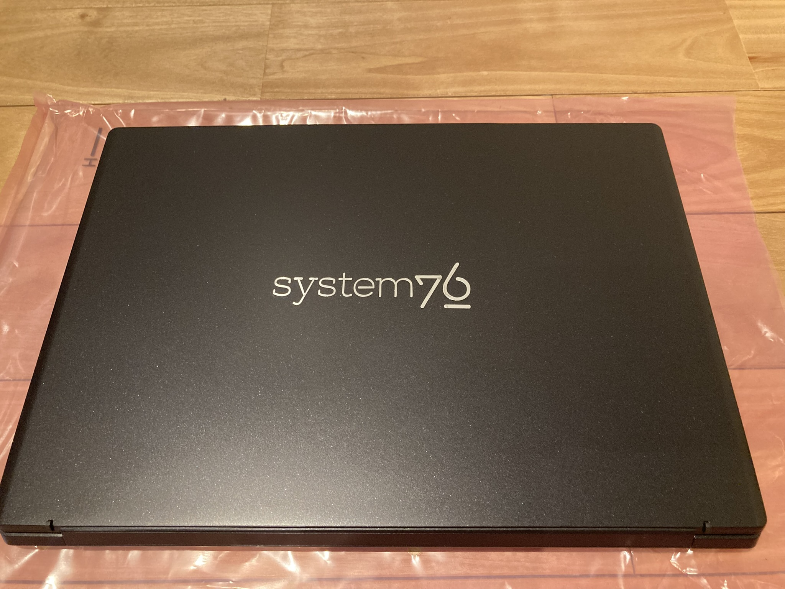
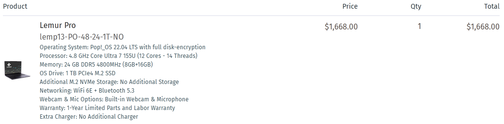
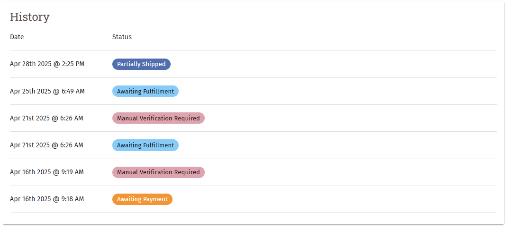
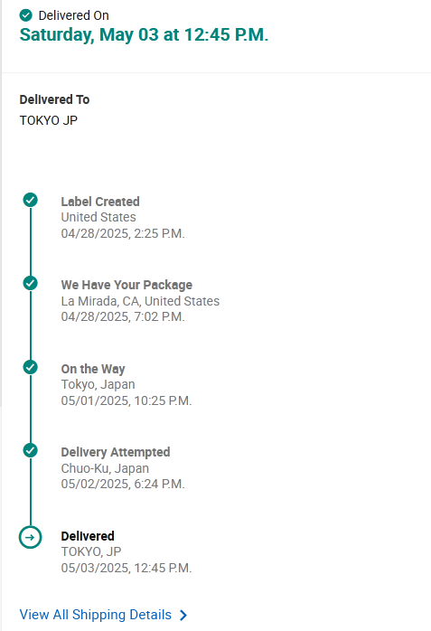
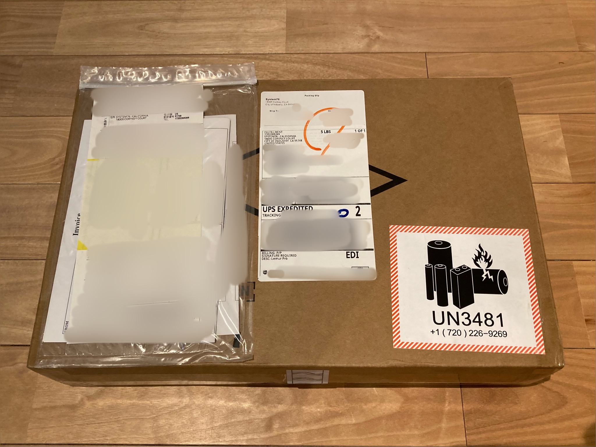
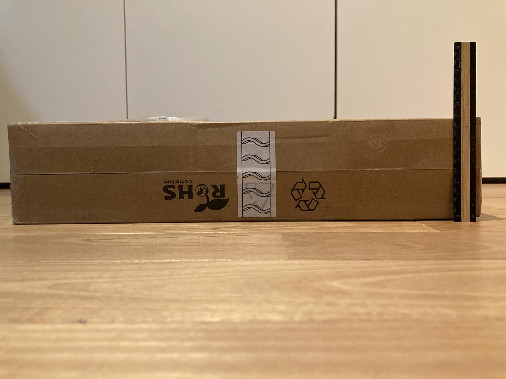
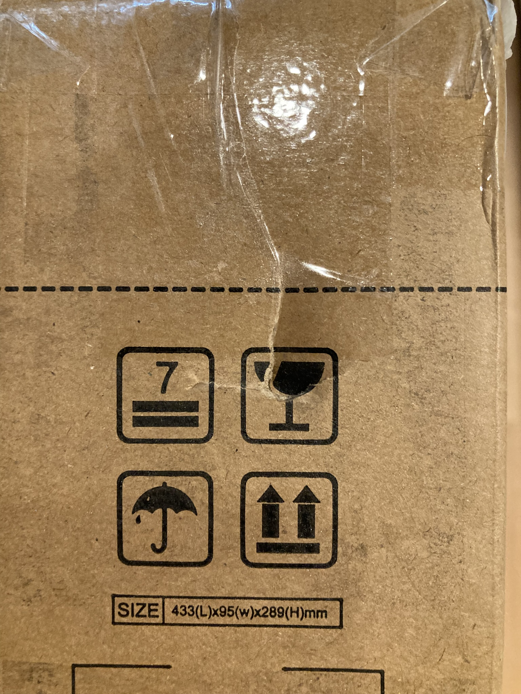
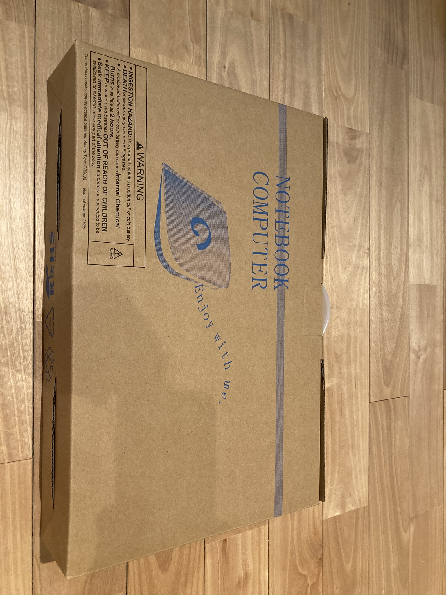
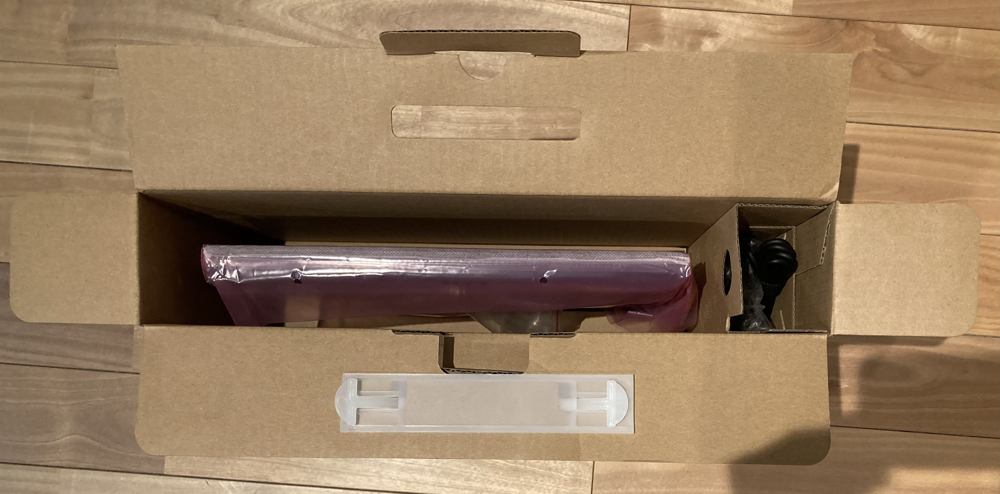
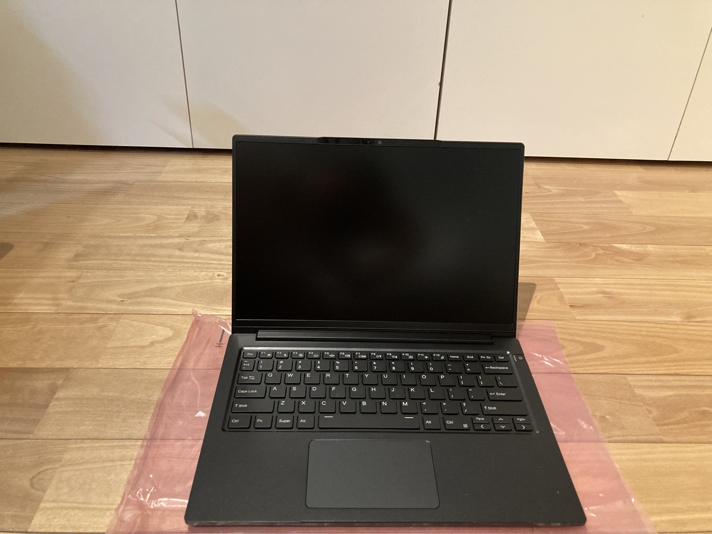

+++
author = "ekkekuru2"
slug="20250503_lemp13"
title = "System76のラップトップLemur Pro 13を買った"
date = "2025-05-03"
description = "大学生活で使うラップトップとして、アメリカの企業、System76 社の Lemur Pro 13 を買いました。"
categories = [
    "Tech"
]
tags = [
    "Linux",
]
+++

大学生活で使うラップトップとして、アメリカの企業、System76 社の Lemur Pro 13 を買いました。

# なぜ System76 の Lemur Pro13 を選んだのか

## 他に検討した機種

- Lenovo Thinkpad X1 Carbon
- Dell の Linux モデルみたいなやつ
- Sony の VAIO
- Framework Laptop

あたりですかね

## Linux との相性

大前提として、ラップトップには Linux を入れたいと思っていました。もちろん Microsoft Office や Adobe、DAW などを使うために Windows は必要になると思うのでデュアルブートすることになると思いますが。

今まで自作 PC に Windows 入れて WSL でいろいろやってたんですが WSL ってメモリめちゃくちゃ食うんですよね。Docker 使うときに、仮想化を二重に挟んでるのもモヤモヤする。

ほとんどの作業を WSL でやってるなら直接 Linux 入れればいいじゃんってなります。

(入れるディストリビューションにもよるが)Linux ならパッケージ管理も整っているし。

あとは、デスクトップ環境をいろいろ変えられたり、そもそもデスクトップ環境を使わずウィンドウマネージャを使うという選択肢もあったりとカスタマイズの幅も広いのも良い。(見た目を変えてイキりたいだけなのでは？というのは否めない)

そうなった時に、デフォルトの OS が Linux で、ファームウェアもオープンな System76 社のコンピュータだと相性がいいのかなという判断です。

## 軽さとバッテリー持ち

私は毎日持ち歩くラップトップは、軽さとバッテリー持ちが正義だと思っています。

Lemur Pro13 は 1kg を切っているらしい。(実測すべき)

公式ページで Up to 14h となっているのは魅力的(と思っていましたが、この 14h はどういう計測なんだろう？日本のパソコンなら大抵は JEITA 規格で統一されていて比較が出来るが、アメリカなので計測方法が不明だということに今この記事を書きながら気づいた。)

性能を求めても所詮バッテリーの電力制限があって、結局電力を無尽蔵に使えるデスクトップ用 CPU には叶わないので。(Apple の M チップはそうとも限らない感じが最近あるが)

## とはいえ性能も大事

Intel Core Ultra 7 155U、メモリ 24GB はまあ良いんじゃないでしょうか。
(調べると 155U は結構省電力モデルなので微妙って情報も見たが)

また、Lemur Pro はメモリを 56GB まで増設出来ます。ラップトップにしては多い方な気がする。

近いうちに増設するぞーー

## ぶっちゃけ

なんか新しいもの、みんなが使ってないものって惹かれちゃいますよねーー

はじめから Windows が入ってないラップトップがあるの！？

UEFI じゃなくてオープンソースなファームウェア coreboot を搭載！？

ラップトップは個性を出す場所ではなくて、普通に生協でおススメされたものを買えばいいということは頭では分かっているんだけどね！！！

ファームウェアがオープンだからといって、現時点で私にはファームウェアをいじる技術力は無いのでなにか変わるわけじゃ無いんだけどね！！

日本語の情報が数件しかヒットしないということに不安もありましたが、それは逆に言えば、人柱になってこういう風に情報を公開すれば価値があるということでもあるはず！(なお、親にお金を出してもらって人柱になるのはいかがなものか)

# 届くまでの流れ

## 4 月 16 日購入

4 月 16 日の夜頃に Web サイトから注文しました。

今の私には支払い能力がなく、大学生活での必要性を認めてもらい親に買ってもらったので、配送先住所は私の名義、クレカは父の名義のものを使いました。これがあとでちょっと面倒くさいことになる。

## ~4 月 25 日 入念な本人確認

４月 17 日 00:48 に本人確認のメールが来ました。支払いに使ったクレカとその名義人の本人確認書類の写真を送れというもの。送りました。

続いて、注文した翌日 4 月 17 日の 22:25(JST)に、追加の本人確認が必要だという内容のメールが来ました。確認方法はクレカの明細の企業名とかが入る欄にランダムな 6 桁の英数字をつけるのでそれを送れというもの。この時点ではまだ決済されていないようで、クレカの明細を確認できませんでした。

直後にもう一通メールが来ました。配送先は私の名義、支払い情報は父の名義となっていて名義が違うのが不審だということなのか、父のメアドを送れと言われます。言われた通り送ったのですが、その後父のメアドに System76 からメールは来ませんでした、何だったんだろう。

4 月 25 日父のクレカの明細が更新されていたので前述の 6 桁の認証コードを送りました。その後 21:49 に確認が取れた旨のメールが届き

> We are now moving your order to our assembly queue

となりました。System76 のコンピュータは入金が確認されてから組み立てているんですね！だから念入りに本人確認をしているのか？

ちなみにクレカは 4 月 21 日付けで決済されており、日本円で 264,783 円でした。このスペックで$1,668 ならちょうどいいかお手頃な気さえしそうな気もしますが、26 万と言われると高い、、、円安、、、

## 4 月 29 日出荷

出荷されました。宅配業者はアメリカの UPS という会社。追跡番号が発行され追跡できるようになります。到着予定日は 5 月 2 日。

## 5 月 2 日 届かない

うきうきしながら待っていましたが、途中でステータスが、

> We planned to deliver your package today but there may be a delay.

となり、結局 5 月 2 日には届きませんでした

ネットで調べると UPS は土日祝日は配送しないと書いてあります。運悪く次の日から GW なので、少なくとも 4 日間はパソコンが届かないことが確定してしまいました。

## 5 月 3 日 届いた！

GW1 日目の 5 月 3 日、朝頃ヤマト運輸の方が配達してくれたようです。私は完全に配達されないものだと思ってたので家族が受け取ってくれました。
それから、受け取りの際に消費税 14,100 円がかかりました。ネットで、受け取り時に関税を払う必要があるという情報は目にしていたのですが家族に伝え忘れていて怒られたので、家族に周知しておくことが大事です。

# 開封

ネットの情報を見てるともっとかわいい箱で届くんだと思ってました。なんだこのデザイン

# 購入後の感想

## 良い点

- 全体的な質感は悪くないと思う
  - 外装はほぼすべてマグネシウム・アルミニウム合金なので
- 分解がしやすい
  - Web サイトで Your Right to Repair とか言われているやつですね。
  - 近年のラップトップでは珍しいのではないでしょうか。
  - さっそくデュアルブートするために M.2 SSD を増設しましたが簡単だった。
- トラックパッドは良い
  - ネットでトラックパッドが微妙という情報を見かけましたが、その後のバージョンアップで改善されたのか、私のトラックパッドへのハードルが低いのか私はそこまで悪く感じませんでした。
  - 質感は Mac のようなガラスっぽいつるつる、かつさらさらした感じです。
  - もちろん確かに Mac と比べたら操作感は劣る気はします。触覚クリックでは無くて普通に沈み込むタイプだし

## 良くない点

- 思ったより天板がべこべこしている。
  - 天板を軽く押すだけで結構沈むし、開くときに結構歪む。
  - こんなもんなのだろうか、たぶん違う気がする。
  - VAIO は日本の朝の通勤電車に耐えるべく 150kgf の耐荷重テストをしているというのを見て、とても不安になった。
- ラメが入っていて思ったよりきらきらしている
  

  - この写真で伝わっているだろうか、、、
  - 照明によって見え方が結構変わるが、ともすれば安っぽく見えかねない質感かも

- バッテリーが膨張するらしい
  - Reddit で検索すると、2 年前くらいに、1 年半くらい使うとバッテリーが膨らんできたという投稿がいくつか見つかる
  - こわーーー
  - 最近の投稿は見つからなかったので、2 年前の 1 年半前のモデルからは改善されていると信じる
  - tlp とかで 80%くらいまでの充電に押さえて使うようにしよう

これ以外にも気づいた点があれば追記しようと思います。

# 総括

購入前の期待が大きすぎた感じはあります。その分実際届いてみた時に些細なことも気になってしまう。結構高い買い物ですしね。

Reddit 見てると System76 は買うな！みたいな投稿もちらほらあって不安に思う反面、大抵のものには批判がつきものだよなーとも思います。

まあ、また買うかどうか、おすすめ出来るかどうか分かるのはもうしばらく使ってみてからになりそうです。

また、この記事を書いている時点では Nix OS をインストールしているのでそれについても後日書きたいと思います。
