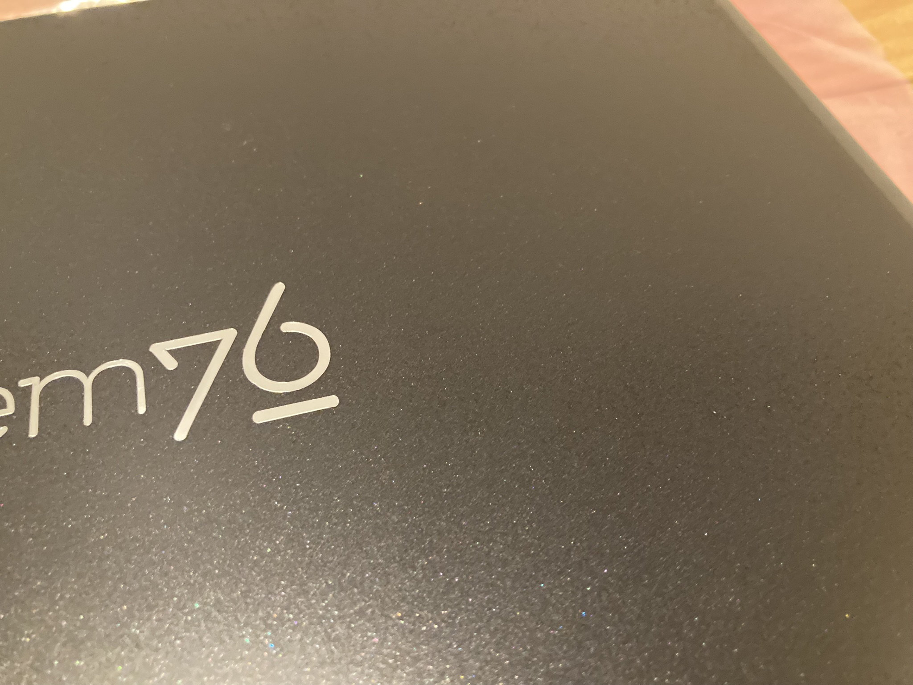

+++
author = "ekkekuru2"
slug="20250503_lemp13"
title = "System76のラップトップLemur Proを買った"
date = "2024-07-18"
description = "System76のラップトップLemur Proを買った。"
categories = [
    "Tech"
]
tags = [
    "Linux",
]
+++

#

## 背景

## 良い点

## 良くない点

# 届くまでの流れ

_大まかな流れ_

## 4 月 16 日購入

4 月 16 日の夜頃に Web サイトから注文しました。

## ~4 月 25 日 入念な本人確認

４月 17 日 00:48 に本人確認のメールが来ました。支払いに使ったクレカとその名義人の本人確認書類の写真を送れというもの。

注文した翌日 4 月 17 日の 22:25(JST)に、追加の本人確認が必要だという内容のメールが来ました。確認方法はクレカの明細の企業名とかが入る欄にランダムな 6 桁の英数字をつけるのでそれを送れというもの。この時点ではまだクレカの明細を確認できませんでした。

直後にもう一通メールが来ました。配送先は私の名義、支払い情報は父の名義となっていて名義が違うのが不審だということになのか、父のメアドを送れと言われます。言われた通り送ったのですが、その後父のメアドに System76 からメールは来ませんでした、何だったんだろう。

4 月 25 日父のクレカの明細が更新されていたので前述の 6 桁の認証コードを送りました。その後 21:49 に確認が取れた旨のメールが届き

> We are now moving your order to our assembly queue

となりました。

ちなみにクレカは 4 月 21 日付けで決済されており、日本円で 264,783 円でした。高い、、、

System76 のコンピュータは入金が確認されてから組み立てているのだと思います。

## 4 月 29 日出荷

出荷されました。宅配業者はアメリカの UPS という会社。追跡番号が

Partially

# 届いた

_外箱_

_厚みは 9cm くらい_

_穴空いてた_

_内箱_

ネットの情報を見てるともっとかわいい箱で届くんだと思ってました。なんだこのデザイン

_開封_

_外観_

_ひらいた_

