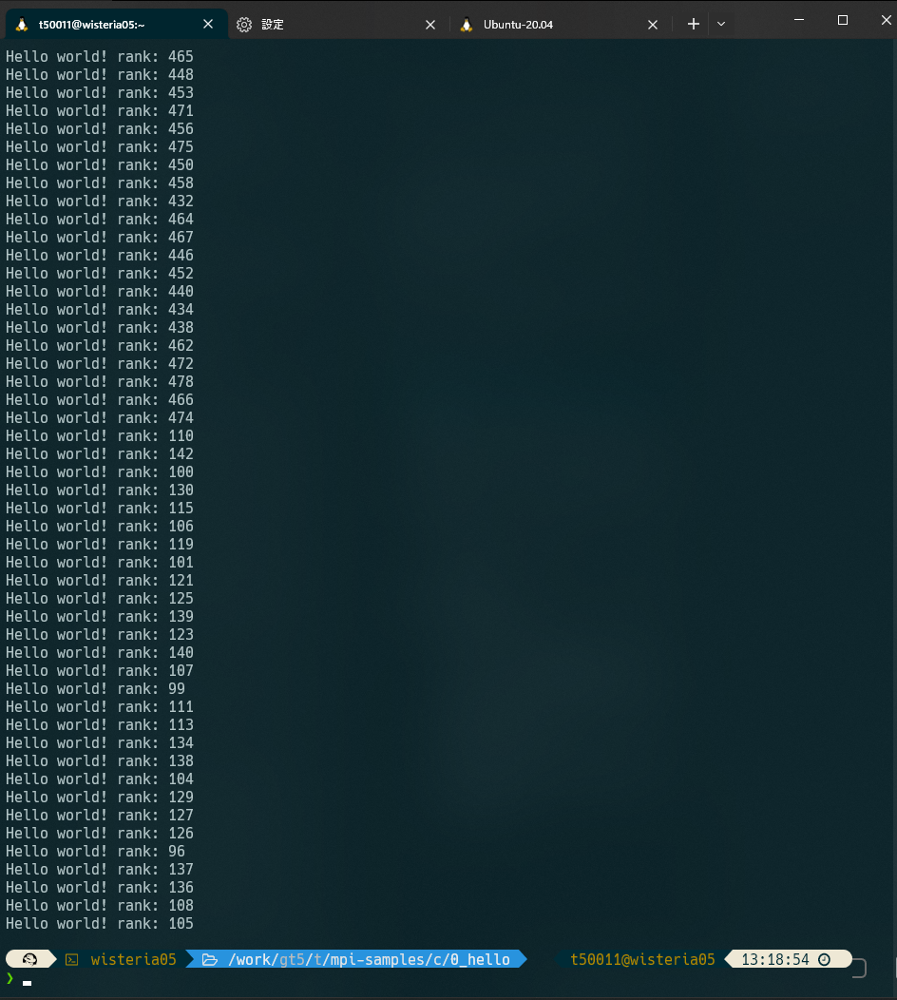
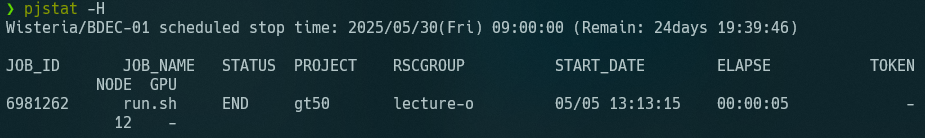
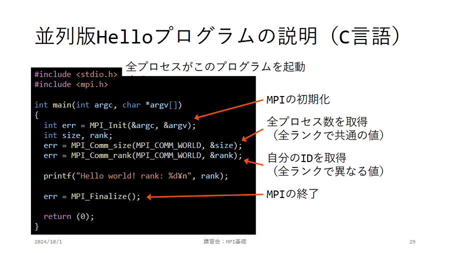
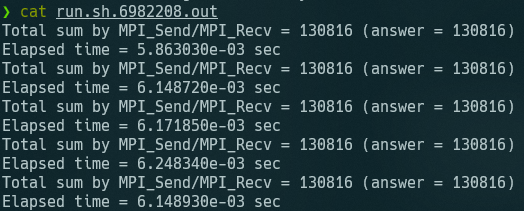
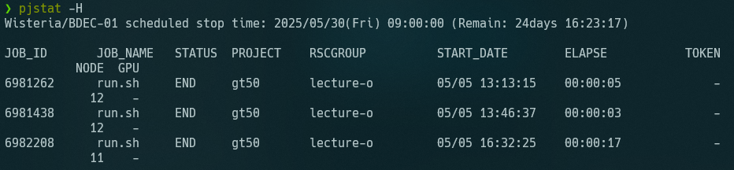

+++
author = "ekkekuru2"
slug="20250510_wisteria"
title = "東大のスパコンWisteriaを使ってみた"
date = "2025-05-10"
description = "2025年のゴールデンウィークに東京大学情報基盤センタースーパーコンピューティング部門が運用しているスーパーコンピュータであるWisteriaを使ってみました。"
categories = [
    "Tech"
]
tags = []
+++

# 概要
2025年のゴールデンウィークに東京大学情報基盤センタースーパーコンピューティング部門が運用しているスーパーコンピュータであるWisteriaを使ってみました。

# 学んだこと
 - ぼんやりと、「スパコンは特殊なので普通のプログラムは動かない」という認識だったのが、要因は主に以下の2つであると分解して理解できた。
   - (Wisteriaの場合は)アーキテクチャがx86_64ではなくARM
   - (こっちの方が重要)処理をどのように並列化するかを自分で明示的にプログラムする必要がある
 - 並列じゃない処理でマージソートや二分探索が有効だったのと似たような手法が並列処理でも使える
 - どういうタスクでスパコンが使えそうか、という感覚が少しだけだが付いた

# 今後の展望

個人的には、x86_64のログインノード上でARMの演算ノード向けにクロスコンパイルしている点や、ログインノードと演算ノードの連携、演算ノード間の通信といったインフラの部分の方に興味を持った。Proxmox上などに仮想マシンをいくつか建ててMPIサーバーを作って並列処理を実行してみたい。

CPUベースのWisteriaと比べて、GPUを搭載したMiyabiではまた勝手がいろいろと違ってきそうなので勉強してみたい。

# 経緯

2025年4月4日。東工大に通っている、高校の先輩から「スパコンが足りていなければぜひ」と、東工大のスパコンの公募の案内のLINEをもらう(しかもいきなり。なぜ？)

東工大のスパコンTSUBAMEを無料で使わせてもらうためには研究課題が公募に採択される必要があり、そんな崇高な研究課題など持っておらず、そもそもスパコンでどういったことができるのかも知らない私は、公募に応募してTSUBAMEを使うことは断念。

でもスパコンは使ってみたい!!「あぁスパコンね〜〜一応使ったことはあるけど」って言いたい!!(ひどい理由)
東工大にあるなら東大にもあるだろう、と東大のスパコンについて調べてWisteriaの存在を知る。

少し調べると、東京大学情報基盤センターでは[お試しアカウント付き並列プログラミング講習会](https://www.cc.u-tokyo.ac.jp/events/lectures/#lec01) なるものが開催されており、それに参加すれば実際にスパコンにログインしてプログラムを実行できるアカウントを得られる(崇高な研究課題など特に無くても)ことを知る。

これは良いことを知ったさっそく参加しようと意気込むのだが、一つ問題があった。講習会がことごとく平日の昼間しかやっていないのだ。情報基盤センターの人も休日は休みたいだろうから当然だが、1年生のSセメスターは出席必須な必修授業が毎日のようにあり参加できない。

4月7日、諦めきれず情報基盤センターの受付に「お試しアカウントだけいただいて、リアルタイムのZoom講義には参加せずに資料と録画映像で自習するといった形の受講は出来ますか？」という内容のメールを送るが、「誠に恐れ入りますが、お試しアカウントのご利用は講習会当日に終日ご参加されることが条件となるためアカウントのみを配布することはお受けいたしかねます。」まあそりゃそうだよね、、、

まあ学部1年生にスパコンは早いか、スパコンを必要とする研究課題が出来てからだよね、と諦めかけていたときたまたま転機が訪れた。4月は履修を決める時期だ。初年次ゼミナールという、いくつかある授業から受講したいものを選ぶ必修科目に、Wisteriaを使うことができる授業があることに気づく。速攻でそれを希望した。

この授業を受けることで、お試しアカウントと同じような(使えるノード数などは少ないが)実際にWisteriaにログインしてプログラムを実行できるアカウントをもらうことができた。初ゼミを担当してくださった先生に授業外の時間でもWisteriaを使って良いか相談したところ、先生から情報基盤センターの方に確認してくださり「お試し講習会」の内容を自習で進めても良いと言っていただけた。特別な対応は無理かなとも思っていたのでありがたい。

またこの先生から、「MPI並列プログラミング(P. パチェコ著)」という本を教えていただいた。伝説のバイブルらしい。駒場図書館には無かったが、駒場の数理科学研究科図書室に収蔵されているようなので借りて読んだ。初めて数学科の建物に入った。

来年以降もこの初ゼミが開講されるかはわからないが、スパコンに興味がある人は初ゼミで体験することもできる。かも。

# MPI基礎講習会を進める

https://www.cc.u-tokyo.ac.jp/events/lectures/232/  に沿って講習会を進めた。これ以降は進めながらメモした内容なので雑。

## 0 Hello, World!

ログインノードのユーザー・グループはどこまで演算ノードと関連付いているのだろうか。このあたりの構成・インフラも気になる

感動ーー！本当に576個ものノードを動かしたんだーー！！

pjstat -H 見るとELLAPSEが5秒になっている。ただのHello,worldと考えると、5秒って結構長いよね

(引用：https://www.cc.u-tokyo.ac.jp/events/lectures/232/20241001-2.pdf)

	- 各プロセスは普通にprintf(標準出力)するだけで、全プロセスの標準出力がまとまって得られるのも不思議？
	- まとめ役的なノードがいる？それはログインノードがやるの？
- Odyssey計算ノードでARM,aarch64を採用している理由は？
	- Apple SilliconやAmpereとかが出てきてからArmが話題になったイメージ。Wisteriaの計画段階でもARMの評判は高かったのか？←私の知識不足という説も
	- x86_64で動く手元のプログラムがそのままスパコンでも動いた方が便利なのでは？
- moduleコマンドのライフサイクルは？loadしたものはいつまで生きている？
	- module showとしてみると、環境変数のセットなどもしている。conflictも管理している？

## 座学の講義動画を見る

https://www.youtube.com/watch?v=pSqm7_dLshw   を見る

- 2:15 命令、データストリームが何のことなのか全くわからない
- 2:45 あーーなるほど。ディスプレイ分割の例はわかりやすい。
- 4:54 MPIは分散メモリ型、1つのノードの中は共有・非対称メモリ型
- 7:50 SPMD複数のコンピュータに共通のプログラムを配布、それぞれに違う入力を渡す
- 9:21 「データアクセスが局所化」初ゼミの授業でも言っていたが、データがメモリ上に綺麗に並ぶことは結構効いてくるのだな。キャッシュヒットというのはRAMの話？CPUの話？
- 14:06 アムダ―ルの法則、いかに並列化できない部分を減らすか
- 15:39 Byte/Flop
	- そもそもFlopという単位を良く知らない
		- 1秒間に[浮動小数点演算](https://ja.wikipedia.org/wiki/%E6%B5%AE%E5%8B%95%E5%B0%8F%E6%95%B0%E7%82%B9%E6%BC%94%E7%AE%97 "浮動小数点演算")が何回できるか
		- だから例示にdouble型を使っているのか
	- Memory Band Width
	- 1.は需要・理想、2.は実際できた供給量ということか
	- メモリアクセスの速度はCPUよりも結構遅くて足かせになるということか
- IIIFはあくまで規格で、いろんな実装があるのと同じ
- 20:50 Fujitsu MPIベースはOpenMPI
- 22:56 プロセスは普通はプロセッサ(あるいはコア)に1対1で割り当てられる←大事
- MPI通信はどのレイヤー(まさかHTTPではないだろうが、TCPなどを使っているのか？もっと下のレイヤーなのか)で通信しているの？
- 26:54 MPI_Send()は1対1の通信。ある人が誰か別の人にデータを送る。
- 27:30 tag 流体シミュレーションをイメージすると、密度なのか速度などを区別
- MPI_Send()とMPI_Isend()の違いは、javascriptの非同期通信のasyncとPromise.all()の関係のようなものだと理解した
- 各MPIプロセスの「演算負荷」を均等にする→初ゼミで言ってたことだ。グリッドを可変にする
- 50:40 言語によってメモリレイアウトが違う。知らなかった

## 2 sum_relay

destとsourceはわかるが、tagを何にすべきかよくわからない
→ref_sum.cを確認したところ、たまたま私も同じ実装をしていた

逐次転送方式だと、全然時間短くならないのでは？前をまつので全く並列化されていない

## 3 sum_binary

「rank & dispがdispと一致」が良くわからない

ソースを読んで理解した
どのノードも送信するのは最大1回
送信したらbreak;してそのノードの仕事は終わり。

sum_relayと比べて1桁分くらい速くなってる
計算速度の評価なんてオーダーが分かればいいっしょ(中央値とか平均値とか計算するのがめんどいだけ)

並列じゃない処理でマージソートや二分探索が有効だったのと似たような手法が使える
