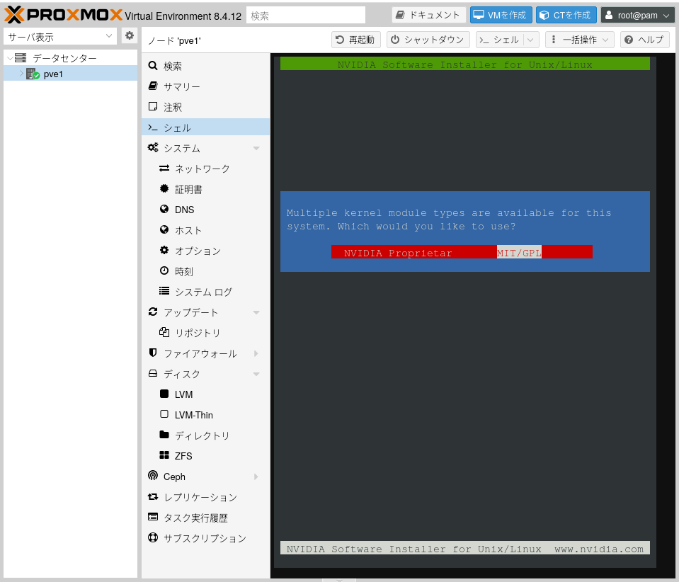
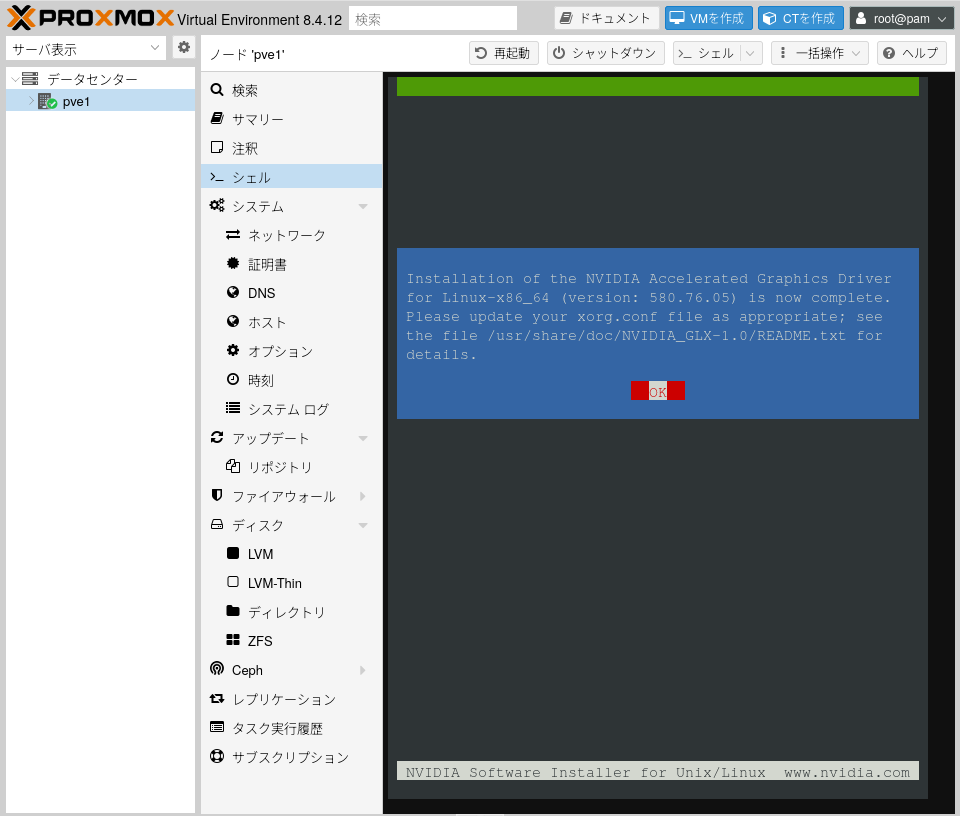
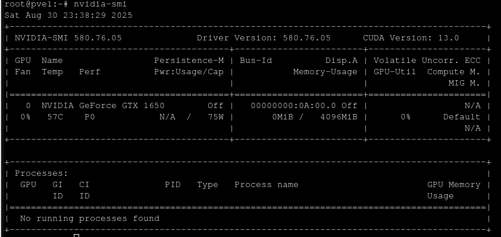
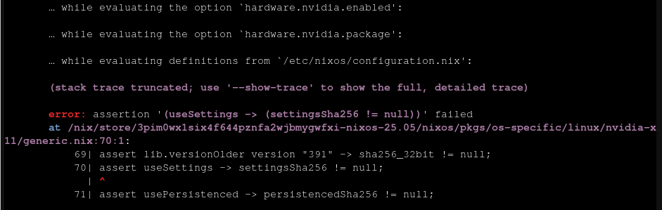
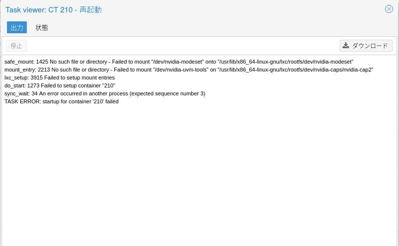
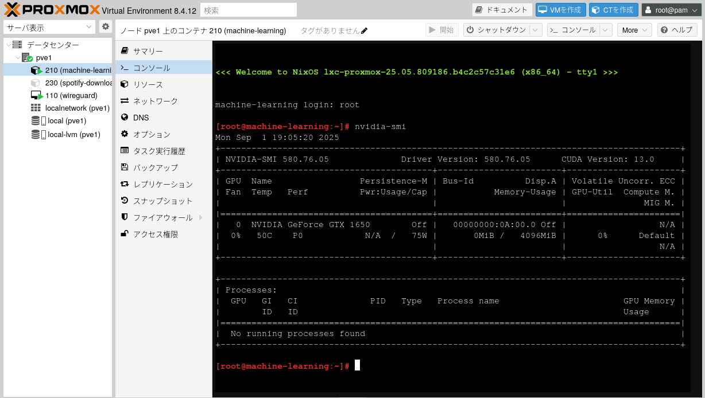

+++
author = "ekkekuru2"
slug="20250831_proxmox_lxc_gpu"
title = "ProxmoxのLXCコンテナにGPUのCUDAコアをパススルーして機械学習サーバー"
date = "2025-08-31"
description = "ProxmoxのLXCコンテナにGPUのCUDAコアをパススルーして機械学習サーバーもどきを作ってみる。"
categories = [
    "Tech"
]
tags = [
    "Linux",
]
+++

# 概要

最近大学の授業で PyTorch や Tensorflow を使って機械学習を動かしているのですが、Google Colab で無料で使える GPU は使用時間の制限が少しキツいと感じるタイミングがありました。課題提出の直前で GPU 制限が来てとても困ることが何回かありました。しかも気づいたら処理が終わる前に接続が切れていたりします。(こまめにチェックポイントを作ればいい、という話ではあるが。)

私のおうちには Proxmox が動いているパソコンがあるので、機械学習サーバーを作ってみます。

といっても、載っている GPU は GTX1650 なので、GPU 性能も大したことないし、今はみんなクラウドで時間貸しで GPU を借りるのがトレンドだというのも知ってはいますが、こういう、基盤構築的なのが好きなのです。だからわざわざ Proxmox 入れておうちクラウドもどきして遊んでいるわけです。

とりあえず今回の目標は LXC コンテナから nvidia-smi コマンドが使えるようにすることです。

# 参考文献

というかほぼそのままなので冒頭に記載しておく。

https://kwatanabe.hatenablog.jp/entry/2020/10/04/202409
https://qiita.com/rewolfiluac/items/df57872d92b9afa5a836
https://gist.github.com/egg82/90164a31db6b71d36fa4f4056bbee2eb

# 手順

```bash
# /etc/apt/sources.list にproxmoxのベースとなっているDebian 12のリポジトリを追加
[+] deb http://deb.debian.org/debian/ bookworm main contrib non-free non-free-firmware
[+] deb-src http://deb.debian.org/debian/ bookworm main contrib non-free non-free-firmware

## buildツールをインストール
apt update
apt upgrade
apt install pve-headers pve-headers-$(uname -r) build-essential
```

https://www.nvidia.com/en-us/drivers/
ここからドライバーを探す

言語選択で Japanese とかの選択肢もあったけど、Linux 用だと関係無く一択のみらしい
現時点での Latest Production Branch Version を入れる

```bash
wget https://us.download.nvidia.com/XFree86/Linux-x86_64/580.76.05/NVIDIA-Linux-x86_64-580.76.05.run
chmod +x NVIDIA-Linux-x86_64-580.76.05.run
```

```
./NVIDIA-Linux-x86_64-580.76.05.run
```

実行。



途中で NVIDIA Proprietary か MIT/GPL かを聞かれる。NVIDIA のドライバが GPL になるのか!？と思って ChatGPT に聞いたところ、ドライバ自体が GPL になるんじゃなくて、NVIDIA のドライバを Linux カーネルに組み込むためのインターフェースが GPL になる、という意味らしい。なるほど。



```
# /etc/modules-load.d/modules.conf に以下のに行を追加
[+] nvidia
[+] nvidia_uvm


update-initramfs -u

nvidia-smi
```



```
# 非特権コンテナからアクセスできるようにする
# /etc/udev/rules.d/70-nvidia.rules に以下の行を追加
[+] KERNEL=="nvidia", RUN+="/bin/bash -c '/usr/bin/nvidia-smi -L && /bin/chmod 666 /dev/nvidia*'"
[+] KERNEL=="nvidia_uvm", RUN+="/bin/bash -c '/usr/bin/nvidia-modprobe -c0 -u && /bin/chmod 0666 /dev/nvidia-uvm*'"
```

ここで再起動。

## LXC コンテナを建てる

最近 NixOS がなんかナウいらしいぞ、とハマっているので、今回の LXC コンテナも NixOS にしてみる。
NixOS は Proxmox の LXC テンプレートには無いし、普通にはインストールできないので、NixOS の公式ドキュメントに従ってインストールする。
とりあえず configuration.nix を貼っておく。

```
{ config, modulesPath, pkgs, lib, ... }:
{
  imports = [ (modulesPath + "/virtualisation/proxmox-lxc.nix") ];
  nix.settings = { sandbox = false; };
  proxmoxLXC = {
    manageNetwork = false;
    privileged = false;
  };
  security.pam.services.sshd.allowNullPassword = true;
  services.openssh = {
    enable = true;
    openFirewall = true;
    settings = {
        PermitRootLogin = "yes";
        PasswordAuthentication = true;
        PermitEmptyPasswords = "yes";
    };
  };

  # Virtualisation
  virtualisation.docker.enable = true;
  # Nvidia Docker
  virtualisation.docker.daemon.settings.features.cdi = true;
  virtualisation.docker.rootless.daemon.settings.features.cdi = true;

  nixpkgs.config.allowUnfreePredicate = pkg: builtins.elem (lib.getName pkg) [
    "nvidia-x11" "nvidia-settings" "nvidia-persistenced"
  ];

  # Enable OpenGL
  hardware.graphics = {
    enable = true;
  };

  # Load nvidia driver for Xorg and Wayland
  services.xserver.videoDrivers = ["nvidia"];


  hardware.nvidia-container-toolkit = {
      enable = true;
    };

  hardware.nvidia = {

    # Modesetting is required.
    modesetting.enable = true;

    # Nvidia power management. Experimental, and can cause sleep/suspend to fail.
    # Enable this if you have graphical corruption issues or application crashes after waking
    # up from sleep. This fixes it by saving the entire VRAM memory to /tmp/ instead
    # of just the bare essentials.
    powerManagement.enable = false;

    # Fine-grained power management. Turns off GPU when not in use.
    # Experimental and only works on modern Nvidia GPUs (Turing or newer).
    powerManagement.finegrained = false;

    # Use the NVidia open source kernel module (not to be confused with the
    # independent third-party "nouveau" open source driver).
    # Support is limited to the Turing and later architectures. Full list of
    # supported GPUs is at:
    # https://github.com/NVIDIA/open-gpu-kernel-modules#compatible-gpus
    # Only available from driver 515.43.04+
    open = false;

    # Enable the Nvidia settings menu,
	  # accessible via `nvidia-settings`.
    nvidiaSettings = true;


    # must correspond with the version of Proxmox host
    package = config.boot.kernelPackages.nvidiaPackages.mkDriver {
      version = "580.76.05";
      sha256_64bit = "sha256-IZvmNrYJMbAhsujB4O/4hzY8cx+KlAyqh7zAVNBdl/0=";
      sha256_aarch64 = "sha256-xctt4TPRlOJ6r5S54h5W6PT6/3Zy2R4ASNFPu8TSHKM=";
      openSha256 = "sha256-ZpuVZybW6CFN/gz9rx+UJvQ715FZnAOYfHn5jt5Z2C8=";
      settingsSha256 = "sha256-ZpuVZybW6CFN/gz9rx+UJvQ715FZnAOYfHn5jt5Z2C8=";
      persistencedSha256 = lib.fakeSha256;
    };
  };


  system.stateVersion = "25.05";
}

```

ちなみに最後の方で lib.fakeSha256 を指定しているのは、nvidia-persistenced の sha256 ハッシュ値がわからなかったからなのだが、エラーの内容を見ると、どうもハッシュが null で無いかしか見ていないようでハッシュの意味とは？？となった。



## LXC を作成するたびに実施する手順

Qiita の丸パクリ

```
modprobe nvidia-uvm
ls /dev/nvidia* -l
# 以下の内容が表示
# crw-rw-rw- 1 root root 195,   0 Jun 13 23:10 /dev/nvidia0
# crw-rw-rw- 1 root root 195, 255 Jun 13 23:10 /dev/nvidiactl
# crw-rw-rw- 1 root root 508,   0 Jun 13 23:10 /dev/nvidia-uvm
# crw-rw-rw- 1 root root 508,   1 Jun 13 23:10 /dev/nvidia-uvm-tools
# /dev/nvidia-caps:
# total 0
# cr-------- 1 root root 511, 1 Jun 13 23:10 nvidia-cap1
# cr--r--r-- 1 root root 511, 2 Jun 13 23:10 nvidia-cap2

# /etc/pve/lxc/<lxc_id>.conf に以下の内容を追記
# <number from previous step>には上記の数値を入力（この例では、195, 508, 511の3つ）
[+] lxc.cgroup.devices.allow: c <number from previous step>:* rwm
[+] lxc.cgroup.devices.allow: c <number from previous step>:* rwm
[+] lxc.cgroup.devices.allow: c <number from previous step>:* rwm
[+] lxc.mount.entry: /dev/nvidia0 dev/nvidia0 none bind,optional,create=file
[+] lxc.mount.entry: /dev/nvidiactl dev/nvidiactl none bind,optional,create=file
[+] lxc.mount.entry: /dev/nvidia-uvm dev/nvidia-uvm none bind,optional,create=file
[+] lxc.mount.entry: /dev/nvidia-modeset dev/nvidia-modeset none bind,optional,create=file
[+] lxc.mount.entry: /dev/nvidia-uvm-tools dev/nvidia-uvm-tools none bind,optional,create=file
[+] lxc.mount.entry: /dev/nvidia-uvm-tools dev/nvidia-caps/nvidia-cap1 none bind,optional,create=file
[+] lxc.mount.entry: /dev/nvidia-uvm-tools dev/nvidia-caps/nvidia-cap2 none bind,optional,create=file
```

デバイスファイルをコンテナにマウントするコンフィグなんだろうな、と思うが、modeset のファイルだけ存在しないファイルをマウントしようとしていてこれでいいのか？となる。

とりあえずそのまま進めると、案の定 LXC の再起動でコケた



ので、modeset の行だけ削除して再起動

その後、nvidia-smi を試すと、無事 GPU の情報が得られた。やったー。



## cudatoolkit,cuDNN

PyTorch や Tensorflow で CUDA を使えるようにするには、NVIDIA ドライバだけではダメで、cudatoolkit も必要。

## Docker でも GPU 使いたい

ナウいやり方は CDI(Container Device Interface)らしい.

前述の COnfiguration.nix に既に書いた通りだが、つまずいたポイントは、
environment.systemPackages に指定するのではダメで、hardware.nvidia-container-toolkit.enable = true; とする必要があること。

```
docker run --rm -it --device=nvidia.com/gpu=all ubuntu:latest nvidia-smi
```

インターネットに例が多い --gpus all は(おそらく)CDI でないやり方のコマンドなので使わない。

# 感想

この前 Linux カーネルのソースコードを覗いてみたら、デバイスドライバがほとんどだったのが意外だったのを思いだした。結局カーネルモジュールが何なのかはいまいちわかっていない。Linux From Scratch とかやりたい。
