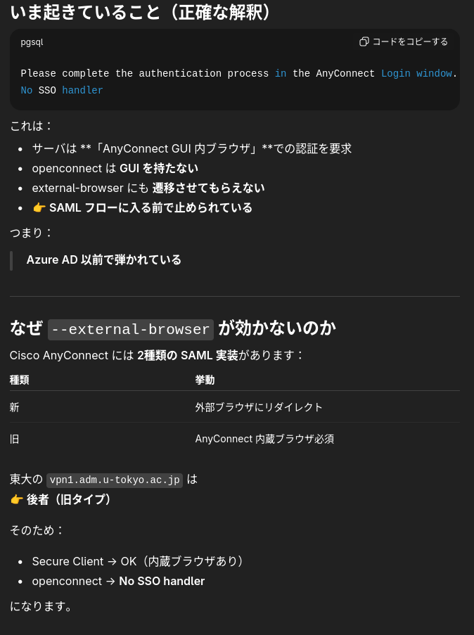
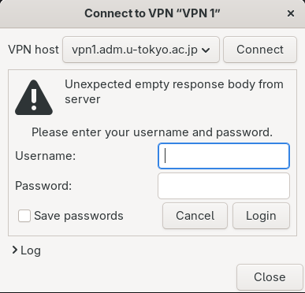
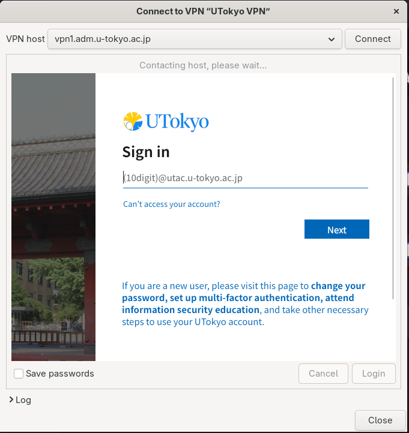
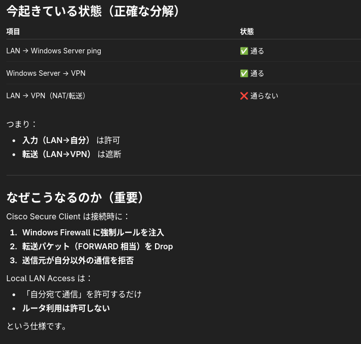

+++
author = "ekkekuru2"
slug="20251231_UToykoVPN_Linux"
title = "LinuxでUTokyo VPN(などのSSO認証が必要なCisco AnyConnect VPN)を使う"
date = "2025-12-31"
description = "ポイントは2つ。networkmanager-openconnectを使う。User AgentをAnyConnectにする。"
categories = [
    "Tech"
]
tags = [
    "Linux",
]
+++

# 概要

UTokyo VPNの実装はCisco AnyConnectというSSL-VPNの一種。Cisco AnyConnectの公式クライアントにLinux版は無いので、簡単にはLinuxから接続することはできない。

ポイントは以下の2点!

- networkmanager-openconnectを使う
- User AgentをAnyConnectにする

「本当にそれだけで動くのーー？？」→ 動いた!  が2連続。


# 詳細 

## networkmanagerを経由するだけで動くの？

Cisco AnyConnect VPNは公式のクライアント以外でもopenconnectというクライアントで接続できるという情報がインターネット上で見つかるので、openconnectをインストールしてみるが、以下のようにNo SSO handlerとなってしまい認証が出来ない。


```
❯ openconnect vpn1.adm.u-tokyo.ac.jp \
  --protocol=anyconnect \
  --external-browser=firefox \
  --useragent="AnyConnect" \
  --os=win

POST https://vpn1.adm.u-tokyo.ac.jp/
Connected to 133.11.205.70:443
SSL negotiation with vpn1.adm.u-tokyo.ac.jp
Connected to HTTPS on vpn1.adm.u-tokyo.ac.jp with ciphersuite (TLS1.3)-(ECDHE-SECP256R1)-(RSA-PSS-RSAE-SHA256)-(AES-128-GCM)
XML POST enabled
Please complete the authentication process in the AnyConnect Login window.
No SSO handler
Failed to complete authentication
```


インターネットで「openconnect sso」などと検索すると、SSO認証が必要ならnetworkmanager-openconnectを使えば良いという情報がヒットする。「networkmanagerを経由するだけで動くようになるって本当か？？」と疑いつつ、やってみたら動いた。


UTokyo VPNに接続するにはUTokyoアカウント(Active Directory)での認証が必要であるが、ChatGPTに聞くと、外部ブラウザで認証画面を開くということは出来ずAnyConnectクライアントに内蔵されたブラウザが必須らしい。
↓ChatGPTの回答



「UTokyo VPNは古い実装なので」とかは本当に？と思う。もしかしたらnetworkmanagerを使わずともコマンドラインのopenconnectのオプションを上手く調整することで繋げられるかもしれないが、networkmanager-connectで動いてしまったのでまあいいや、となっている。

私はNixOSを使っているので、NixOSのconfiguration.nixを以下のように設定
なお、openconnect自体もインストールする必要がある模様

```configuration.nix
  networking.networkmanager = {
    enable = true;
    plugins = with pkgs; [
      networkmanager-openconnect
    ];
  };

  
  ...


  environment.systemPackages = with pkgs; [
    ...
    openconnect
  ];
```


## User AgentをAnyConnectにする

GNOMEを使っているので、GNOMEのネットワーク設定からopenconnect VPNを構成して接続を試みると、(Azure ADのログイン画面ではなく)以下の画面でユーザー名とパスワードを要求される。



SSOのID・パスワードをID Provider以外の画面に入れるのはセキュリティ的にダメだよなーと思いつつ入れるが、認証は通らず。


さらに調べると以下のような記事がヒットする。User Agentを"AnyConnect"にすれば良いらしい。

https://gitlab.com/openconnect/openconnect/-/issues/602


私はまたもや「いやいやUser Agentなんていくらでも偽造できちゃうじゃんー本当に？？」と疑うのだが、やってみたら動いた。




User Agentを見ているらしい!


# 余談

はじめは、Cisco AnyConnectは公式クライアント以外にもopenconnectを使って接続できるということを知らなかったので、Windows ServerにCisco AnyConnect公式クライアントを入れて、Windows Serverに宛てられたパケットをUTokyo VPN経由でルーティングしようと試みた。


しかしpktmonするとDropされてしまっている。


ChatGPTに聞くと↓




この制御が、どのレベルでどういう仕組みで行われているのか、なぜ消せないのかがよく分かっていない。


