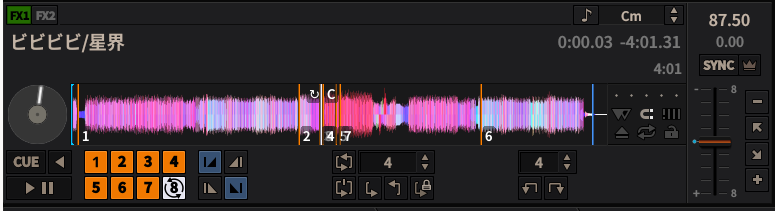
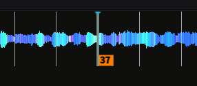

+++
author = "ekkekuru2"
slug="20260227_mixxx_hotque_36"
title = "DJソフトmixxxでホットキューを36個使って遊ぶ"
date = "2026-02-27"
description = "パッと見の画面上では8個しかホットキューが設定できないように思われるmixxxであったがキーボードショートカットを変えることでホットキューを36個設定できた。と思いきや仕様の限界を超えて37個目が設定できた。"
categories = [
    "Tech"
]
tags = [
    "Linux"
]
+++

# 概要
DJソフトmixxxではホットキューを最大36個設定できることが公式ドキュメントにも記されている( https://manual.mixxx.org/2.0/ja/glossary#term-hotcue )のだが、画面上ではどう頑張っても8個しかボタンが出てこない。




悲嘆に暮れていたのだが、キーボードショートカットを変えることで無事36個のホットキューの設定ができた。


最近聴いていて、刻んだり入れ換えたりしたら楽しそうだなと思った曲にいっぱいホットキューをつけて遊んでみた↓


mixxxのマニュアルはちゃんと読んでいないのでもっと普通な方法でも出来るのかもしれないし、DJも初心者なので全然分からない。


# Mixxxのキーボードショートカットの変え方

( https://manual.mixxx.org/2.5/ja/chapters/advanced_topics#advanced-keyboard )


を参考にやれば良い。


Nix OSの場合は /usr/local/share は無いので、デフォルトのキーマップは /nix/store/(ハッシュ)-mixxx-(バージョン)/share/mixxx/keyboard にある


今回はとにかくホットキューをたくさん設定することにこだわったので以下のようになった。


```
[Channel1]
play Space

beatjump_backward Left
beatjump_1_backward Shift+Left
beatjump_forward Right
beatjump_1_forward Shift+Right

hotcue_1_activate 1
hotcue_2_activate 2
hotcue_3_activate 3
hotcue_4_activate 4
hotcue_5_activate 5
hotcue_6_activate 6
hotcue_7_activate 7
hotcue_8_activate 8
hotcue_9_activate 9
hotcue_10_activate q
hotcue_11_activate w
hotcue_12_activate e
hotcue_13_activate r
hotcue_14_activate t
hotcue_15_activate y
hotcue_16_activate u
hotcue_17_activate i
hotcue_18_activate o
hotcue_19_activate a
hotcue_20_activate s
hotcue_21_activate d
hotcue_22_activate f
hotcue_23_activate g
hotcue_24_activate h
hotcue_25_activate j
hotcue_26_activate k
hotcue_27_activate l
hotcue_28_activate z
hotcue_29_activate x
hotcue_30_activate c
hotcue_31_activate v
hotcue_32_activate b
hotcue_33_activate n
hotcue_34_activate m
hotcue_35_activate ,
hotcue_36_activate .

hotcue_1_clear Shift+!
hotcue_2_clear Shift+@
hotcue_3_clear Shift+#
hotcue_4_clear Shift+$
hotcue_5_clear Shift+%
hotcue_6_clear Shift+^
hotcue_7_clear Shift+&
hotcue_8_clear Shift+*
hotcue_9_clear Shift+(
hotcue_10_clear Shift+q
hotcue_11_clear Shift+w
hotcue_12_clear Shift+e
hotcue_13_clear Shift+r
hotcue_14_clear Shift+t
hotcue_15_clear Shift+y
hotcue_16_clear Shift+u
hotcue_17_clear Shift+i
hotcue_18_clear Shift+o
hotcue_19_clear Shift+a
hotcue_20_clear Shift+s
hotcue_21_clear Shift+d
hotcue_22_clear Shift+f
hotcue_23_clear Shift+g
hotcue_24_clear Shift+h
hotcue_25_clear Shift+j
hotcue_26_clear Shift+k
hotcue_27_clear Shift+l
hotcue_28_clear Shift+z
hotcue_29_clear Shift+x
hotcue_30_clear Shift+c
hotcue_31_clear Shift+v
hotcue_32_clear Shift+b
hotcue_33_clear Shift+n
hotcue_34_clear Shift+m
hotcue_35_clear Shift+<
hotcue_36_clear Shift+>

[KeyboardShortcuts]
FileMenu_LoadDeck1 Ctrl+o
FileMenu_LoadDeck2 Ctrl+Shift+O
FileMenu_Quit Ctrl+q
LibraryMenu_NewPlaylist Ctrl+n
LibraryMenu_NewCrate Ctrl+Shift+N
ViewMenu_ShowSkinSettings Ctrl+1
ViewMenu_ShowMicrophone Ctrl+2
ViewMenu_ShowVinylControl Ctrl+3
ViewMenu_ShowPreviewDeck Ctrl+4
ViewMenu_ShowEffects Ctrl+5
ViewMenu_ShowCoverArt Ctrl+6
ViewMenu_MaximizeLibrary `
OptionsMenu_EnableLiveBroadcasting Ctrl+l
OptionsMenu_EnableVinyl1 Ctrl+t
OptionsMenu_EnableVinyl2 Ctrl+y
OptionsMenu_EnableVinyl3 Ctrl+u
OptionsMenu_EnableVinyl4 Ctrl+i
OptionsMenu_RecordMix Ctrl+r
// DEVELOPER MENU
OptionsMenu_ReloadSkin Ctrl+Shift+R
OptionsMenu_DeveloperTools Ctrl+Shift+T
OptionsMenu_DeveloperStatsExperiment Ctrl+Shift+E
OptionsMenu_DeveloperStatsBase Ctrl+Shift+B
DeveloperMenu_EnableDebugger Ctrl+Shift+D
OptionsMenu_EnableShortcuts Ctrl+`
```


> Note that the situation is a bit different with the menubar shortcuts in the [KeyboardShortcuts] section. If you want to use any of these default menubar shortcuts for something else, it is not sufficient to remove the respective line from the mapping file. The menubar will use the hard-coded defaults if doesn't find an entry in the mapping file. Hence, to use any of the menubar shortcuts, you need to supply another key to be picked up by the menubar. This may be an unused key, or if you don't need the menubar shortcut at all, a key that's not present on your keyboard and can also not be composed by accident, for example Cyrillic characters on a french keyboard.

ドキュメントに注意されていたこれにまんまとひっかかった。[KeyboardShortcuts] の項目は消してはいけない。消したい場合は使わないキーを割り当てるしかないようだ。


今回のように繰り返しを多用する場合はコンフィグファイルでも良いが、普通にちょっとキーマップ変えたい、みたいな設定はGUI上では出来ないのかな。PR出すか？

# 余談

hotcue_36_activate を36より大きくしたらどうなるのか、気になるよねーーーということで、 hotcue_37_activate を追加したら....



え!こういうタイプの仕様で行けることあるんだ!


mixxxのホットキューの最大数は37でした。


ホットキューをたくさんつけられると「この曲のここが良い!」みたいなポイントをメモしておくのに使えて良い。(これはDJ的にはホットキューの使い方として合っているのだろうか。)


