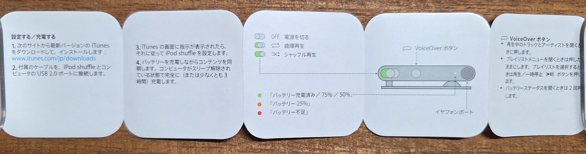
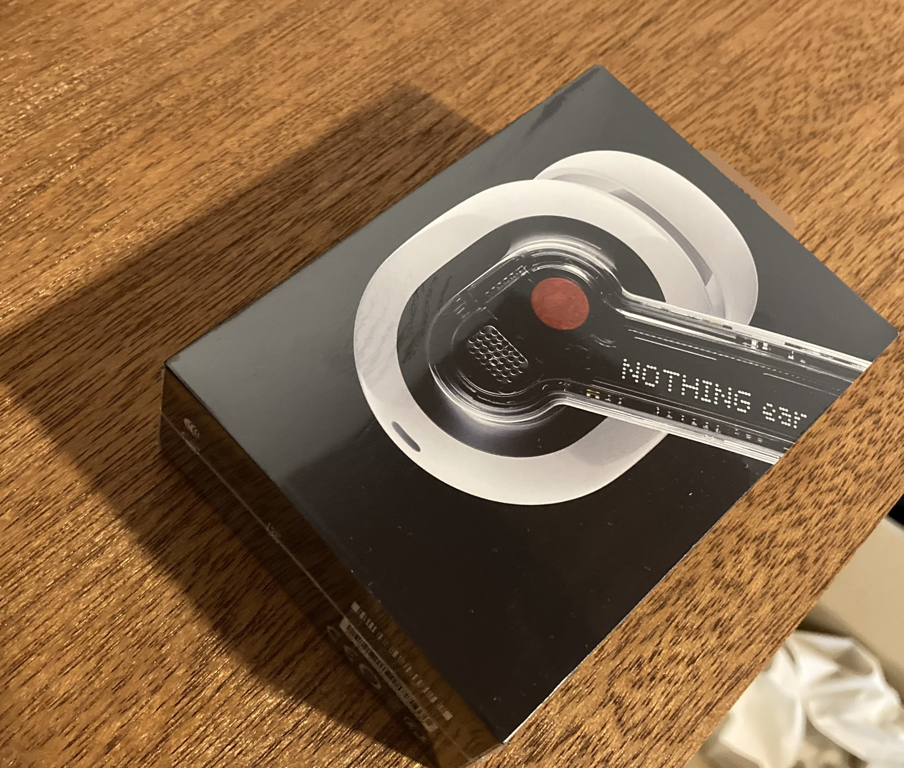
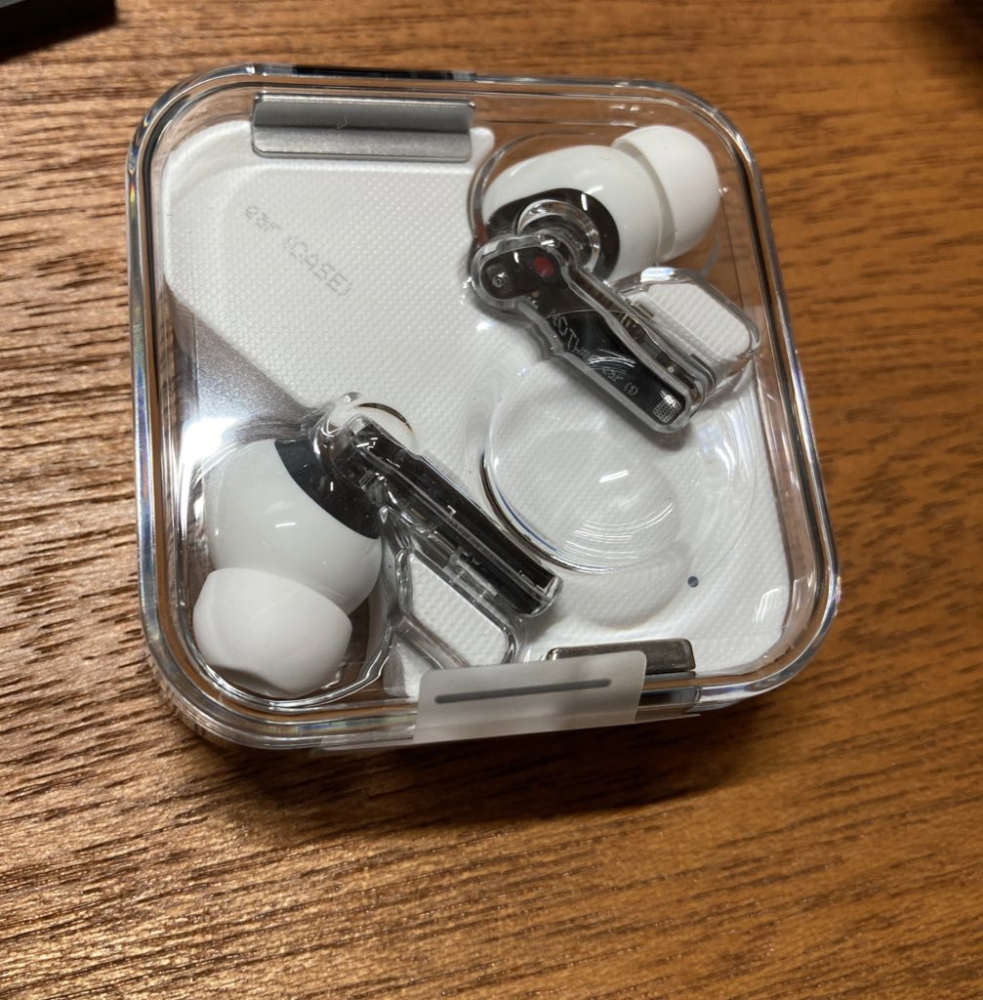
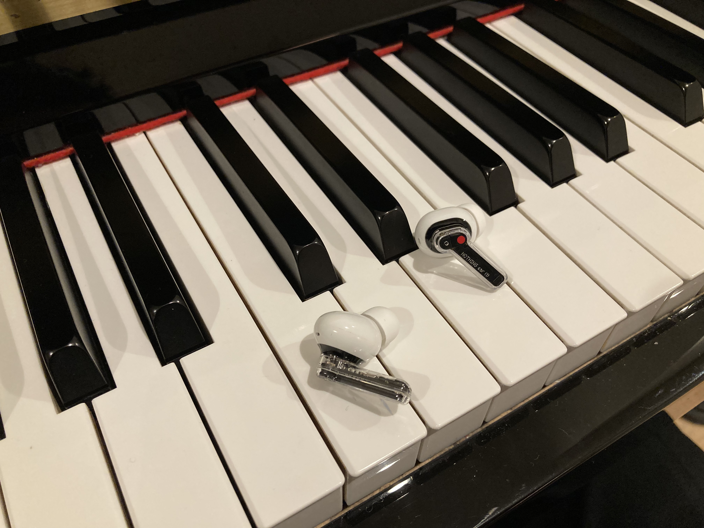
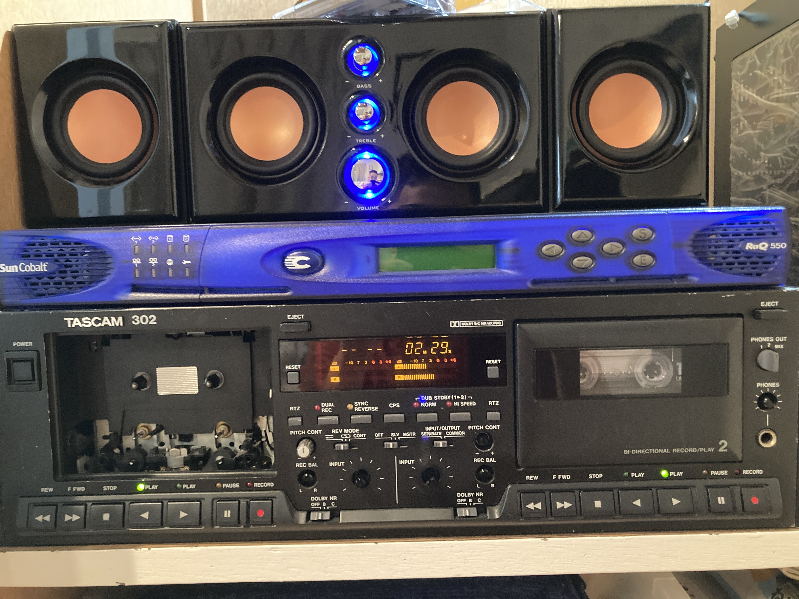

+++
author = "ekkekuru2"
slug="20260519_ipod_shuffle"
title = "iPod shuffleを買った。および、僕の音楽プレイヤー遍歴(一部)"
date = "2026-05-19"
description = ""
categories = [
    "Diary"
]
tags = [
    "music"
]
+++
# iPod shuffle 第4世代を買った

iPod shuffleを買った。なぜなら買わなくてはいけなかったからだ。iPod shuffle 第4世代は最高のデザインだと思っているApple製品の1つだ。この小ささ、アルミ削り出しの正方形ボディ。てかまず画面が無いっていうのがいつまでも古くならないよね。他にはMacBook Air 11inchとかもすごく好きです。あの薄さ、小型さ、光るリンゴ(2016年とか？(たしか)のMacBook 12インチも良いけどリンゴが光らないからなー)。欲しい。

そういうわけでiPod shuffle 第4世代は長らく欲しかったのだが某オクで新品未開封が出ていて、ちょうど貯まったポイントがあったので何の迷いもなく落札していた。

## iTunesで音楽を転送

付属のイヤホンは3極なのですが、付属のUSB to 3.5mmジャックのケーブルの3.5mmジャックは4極。なるほど、4極あればUSB2.0の通信ができるのか!前から思ってたけどこれってUSBの規格的にはOKなの？USB-Aのオス-オスケーブルはだめみたいな規約あるよねたしか。

記念すべき1回目の転送では何を入れようかと迷ったが、ちょうど2026年4月からダウンロード出来るようになったヨルシカの「幻燈」のアルバムを入れました。ヨルシカは長く聴いているアーティストの1つです。幻燈の中だと雪国が一番好き。

あとは何かピアノの曲を入れたいと思ったのですが、せっかく2026年にiPod shuffleで聴くという変なこだわりを見せているのだから、ちょっと変わっているなと思っているエリックサティのピアノを入れておきました。

## いざ、聴くぞ、と思ったら

バッテリーの充電にすごく時間がかかる。、
付属品(新品未開封の特権)の「はじめに」を読むと少なくとも3時間充電します、と書いてある。

バッテリーセルの容量はどう考えても小さいのにこんなに時間がかかるのは、イヤホンと共用の3.5mmジャックでUSB接続してることも関係しているんだろうか。

充電を待つ間にこの記事を書く。

# 音楽プレイヤー遍歴(一部)

良い機会なので今までなにで音楽を聞いてきたのかを振り返ってみることにする。
ところでこのブログ、当初は専ら技術的なことを書く技術ブログのつもりだったのですが、、、？？

友人が書いていた、[MacBook Pro (Mid 2014)でFedora Linuxをデュアルブートしよう](https://zenn.dev/itsukikigoshi/articles/fedora-macbook#%E3%82%B3%E3%83%A9%E3%83%A0%3A-%E5%8E%B3%E6%A0%BC%E3%81%AAwindows%E5%AE%B6%E7%B3%BB%E3%81%AB%E7%94%9F%E3%81%BE%E3%82%8C%E3%81%9F%E7%A7%81%E3%81%AEapple%E3%81%AB%E5%AF%BE%E3%81%99%E3%82%8B%E6%83%B3%E3%81%84)というZennの記事(人生を振り返るコラムが40%くらいを占めている)に影響されているのかもしれません。「そろそろFedoraをインストールするか？？→まだしない、、、」の繰り返しでとても面白かった。

あるいは、自己顕示欲があふれだしている。最近TwitterやInstagramは投稿できない。TwitterやInstagramは人様のタイムラインに強制的に投稿を流し込めるのがヤバい。知り合いとはほぼ義務的に相互フォローになっているのだから、そんなタイムラインに自由に投稿を流し込めるSNSを解禁してしまったら、私の自己顕示欲は爆発してしまいますよ。

## ウォークマン NW S-774

たしか小1のときに両親に買ってもらった。両親からの手紙には「機械と音楽が好きな○○くんへ」とあったのがすごく記憶に残っている。今でも「機械と音楽が好きな」少年だなーと思うしこれからもそうありたい。
このウォークマンには録音という機能があり、CDプレイヤーなどのイヤホンジャックに接続して曲を取り込むことが出来た。CDプレイヤーの出力音がそのまま記録されるのでボリュームや曲の区切りを上手く操作しないとなのだが、使い始めた初日から上手く録音できなかった小1の僕は「ミスった録音を削除するにはバッテリーを抜くしかない」と思い込み(バッテリーを抜いても当然削除はされない)、上部の開けることを想定されていないバッテリー蓋を無理やり開けようとして初日から傷をたくさんつけてヘコんだことをなぜか鮮明に覚えている。普通にパソコンを使えば消せた。

曲は何回も入れかえてしまい、小1の僕がどんな音楽を入れていたのか、今となってはまったくわからない。あのとき消したかった曲が今は聴きたい曲になっている。

SONYのいたわり充電(毎回の充電を80%くらいで止める)の威力はすごくて、今でも一日使えるくらいにはバッテリーは持つし、付属のイヤホンのクオリティも高くてなお一軍のイヤホンである。S-774って別にウォークマンの中でハイエンドじゃないはずだけど音はすごい良い。

実はこれを買うとき、ヤマダ電機でiPod nanoと悩んでいた。結局iPod nanoは使ったことが無いのでなんとも言えないが、ウォークマンはすごい好きになった.

## Beats X

中学生のときにお年玉で買う。私がAppleを一番好きだったのはこのくらいの時期。今のAppleが良くないとかそういうことではなくて(そんなこと言える立場はなくて)、全然Apple製品買えなくて(中学生なので当然ではあるが)、こじらせている。

ある日突然電源が入らなくなってしまった。今見たらホコリを被っていてあまり公開できるような状態じゃなかったので写真

どこへ行くにもBeats Xを首からかけてるイタいガキな時期があった記憶。まだiPhoneは持っていなかったので、iPadか、ウォークマンからBluetooth接続して聴いてた。

## Nothing ear (1)

現役。最近はNothing headphoneも気になっています。

## (番外編)カセットテーププレイヤー

# おわり

最後の方雑すぎるけど眠いので寝る。まだiPod shuffleの充電は出来ておらず起動しない。

